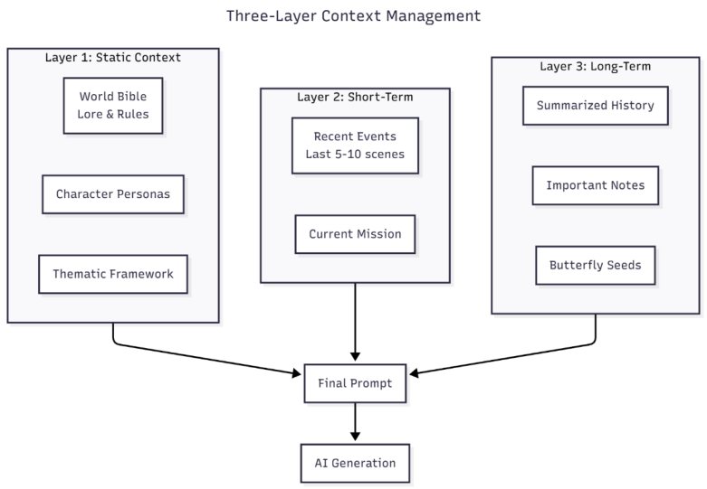
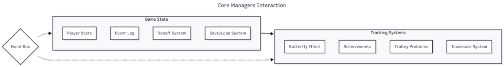
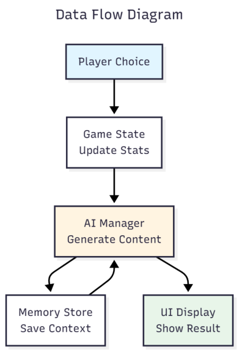
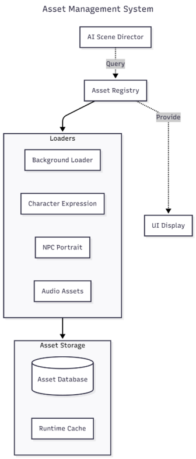
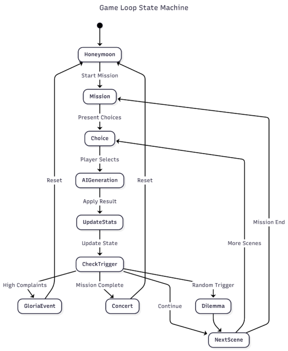
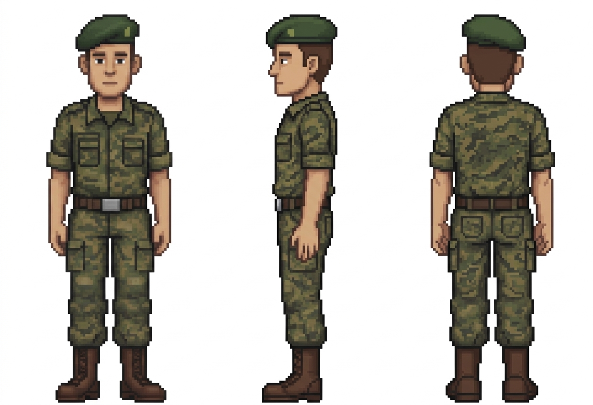
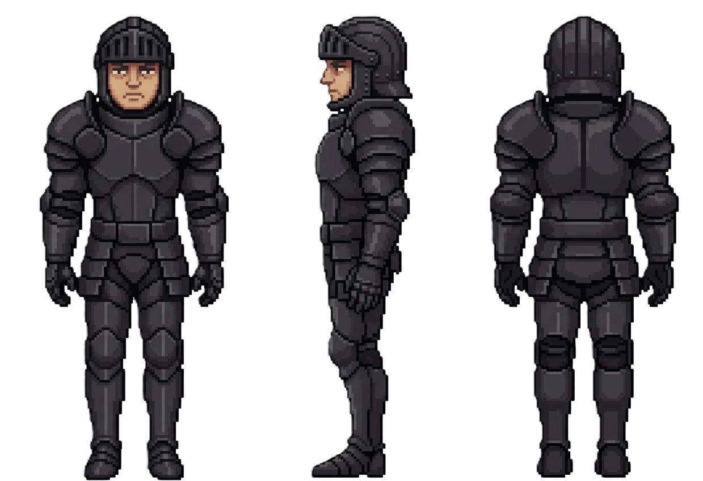
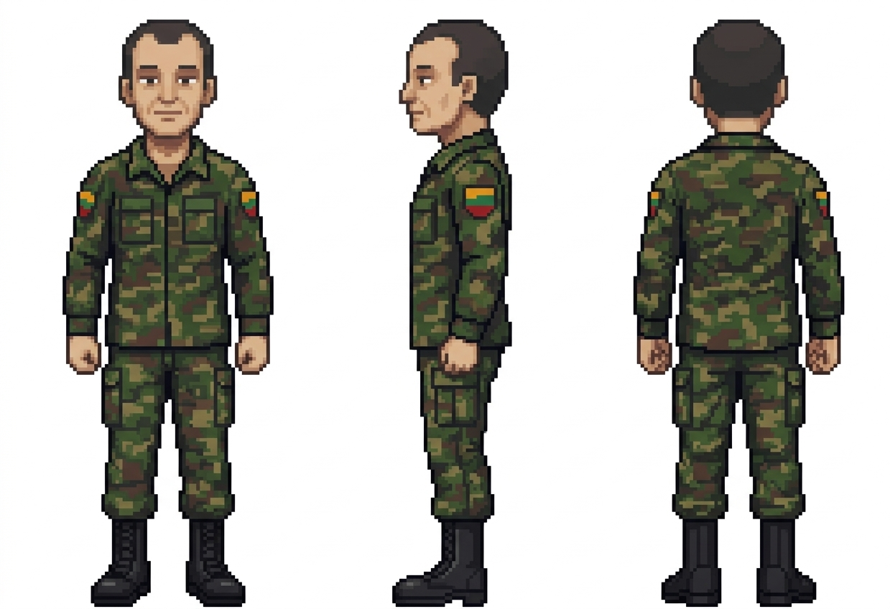
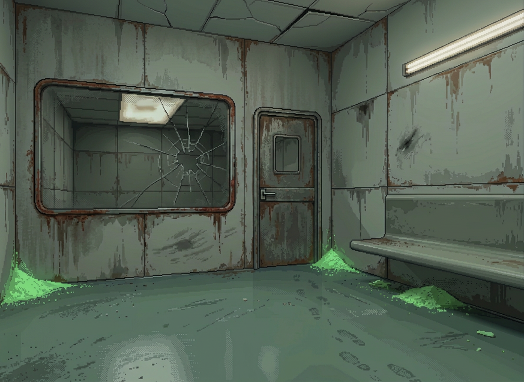
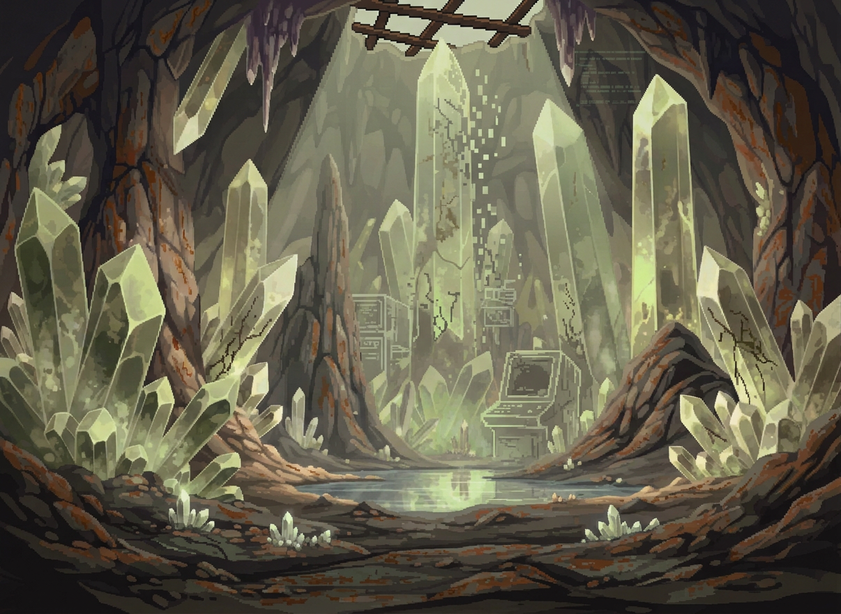

::: titlepage
**University of Sussex**\
School of Engineering and Informatics\
**G5038: Individual Project**\
Final Report\
**AI-Powered Dynamic Narrative System for RPGs**\

  ---------------------------------------------------------------------------------------------------------------------------------------------------------------------------------- ---------------------------------------
                                                                                                                                                                         **Author:** Duncan Law
                                                                                                                                                               **Candidate Number:** 281967
                                                                                                                                                                  **Degree Course:** BSc Digital Media and Games Computing
                                                                                                                                                                     **Supervisor:** Dr Dan Creed
                                                                                                                                                             **Year of Submission:** 2026
                                                                                                                                                                     **Word Count:** \[Run with --shell-escape\]
    *Word count excludes: bibliography, footnotes/endnotes, appendices, abstract/summary, figure legends, tables, and acknowledgements, per University of Sussex assessment policy.* 
  ---------------------------------------------------------------------------------------------------------------------------------------------------------------------------------- ---------------------------------------

{width="26%"}
:::

# Statement of Originality {#statement-of-originality .unnumbered}

This report is submitted as part requirement for the degree of BSc Digital Media and Games Computing at the University of Sussex. It is the product of my own labour except where indicated in the text. The report may be freely copied and distributed provided the source is acknowledged.

I hereby **give** permission for a copy of this report to be loaned out to students in future years.

**Signature:**

**Date:**

# Acknowledgements {#acknowledgements .unnumbered}

I would like to thank my supervisor, Dr Dan Creed, for his guidance and support throughout this project. His feedback during our regular meetings helped shape both the technical direction and the critical analysis presented in this report.

On a personal note, I am deeply grateful to the late Sita Chan. Although she tragically passed away in 2013, her enduring music provided the essential soundtrack that kept me focused and comforted during countless late-night coding and debugging sessions.

Finally, this project has been a personal reminder of the importance of balance. The process of building a game that critiques relentless productivity and blind optimism naturally prompted reflection on those same values in my own approach to work. I hope that message resonates with anyone who plays it.

# Summary {#summary .unnumbered}

This project investigates the integration of Large Language Models (LLMs) into interactive narrative games through the development of "Glorious Deliverance Agency 1," a 2D text-based RPG built in the Godot engine. The game employs a bespoke pipeline architecture where the LLM operates within explicit developer-defined constraints to generate dynamic narrative content whilst maintaining thematic coherence.

The implementation features a multi-provider AI architecture supporting Gemini, OpenRouter, Ollama, OpenAI, Claude, LM Studio, AI Router, and Mock providers, enabling development flexibility and cost management. A three-layer context-management system balances narrative coherence with token efficiency, whilst the "Reality vs. Positive Energy" thematic framework constrains AI generation to produce satirically appropriate content.

Key technical contributions include the Strategy pattern for provider abstraction, an EventBus for cross-module communication, and defensive multi-stage response parsing to handle non-deterministic AI outputs. The project demonstrates that bespoke pipeline approaches can successfully integrate LLM-generated content into playable games, providing practical insights for developers considering similar integrations.

Functional testing across approximately one hundred narrative generations achieved fewer than ten percent requiring intervention due to tonal inconsistency, meeting the defined success criteria. The comparative analysis identifies concrete trade-offs between bespoke pipelines and world model approaches regarding control versus emergence, development complexity versus scope, and predictability versus novelty.

# Introduction

## Project Aims and Objectives

This project develops "Glorious Deliverance Agency 1," a 2D text-based RPG built in the Godot engine that uses Large Language Model (LLM) integration to generate dynamic narrative content. The game places players as a reluctant hero in a dysfunctional team, whose attempts to save the world with "positive energy" only accelerate its destruction through a darkly comedic narrative that responds to their choices in real-time.

Traditional RPG narratives rely on pre-scripted dialogue trees and fixed storylines, limiting replayability and player agency. While LLMs offer the potential for dynamic content generation, integrating them into games presents significant challenges: maintaining narrative coherence over extended play sessions, ensuring thematic consistency with authorial intent, and managing the practical constraints of API latency and token costs. This project investigates whether a carefully structured "bespoke pipeline" approach, where the LLM operates within explicit developer-defined constraints, can address these challenges to produce a playable, thematically coherent RPG experience. The central research question is therefore: to what extent can a text-based LLM, integrated as a controlled component within a traditional game engine, generate coherent and thematically consistent narrative content for an interactive RPG?

The primary aim is supported by three foundational pillars. The first pillar, Technical Development, involves the design and implementation of a functional AI-driven 2D RPG narrative system. The game will feature dynamically generated storylines and NPC dialogue, where "dynamically" refers to the real-time generation of narrative content based on the current game state and player choices, moving beyond traditional pre-scripted narratives. The technical focus is on enabling emergent, non-linear story paths while maintaining narrative coherence over extended gameplay sessions through a three-layer context-management system (detailed in Appendix C: GDD, Section 7.2).

The second pillar, Thematic Execution, centres on creating a satirical allegory exploring the conflict between "positive energy" ideology and the concept of Void Entropy. The core gameplay mechanics, including the Reality vs. Positive Energy system and the Prayer System, deliberately subvert conventional RPG expectations (see Appendix C: GDD, Sections 4.2--4.3 for detailed mechanics). These thematic concepts are embedded directly into the AI's prompt engineering, ensuring that generated content aligns with the project's darkly satirical tone rather than producing generic positive outcomes.

The third pillar, Critical Analysis, involves producing a comparative analysis of the "bespoke pipeline" methodology against the theoretical "world model" paradigm. This examination covers architectural trade-offs between fine-grained developer control and emergent simulation capabilities, the shifting role of the developer from systems architect to high-level director, and the practical feasibility of each approach based on direct implementation experience.

To ensure these aims remain achievable within the project's constraints, concrete success criteria have been defined. For Technical Development, success means producing a functional prototype that can generate coherent narrative content across multiple consecutive scenes without critical errors, with measurable metrics including API response latency under five seconds and successful context preservation across save/load cycles. For Thematic Execution, success means the AI consistently generates content that aligns with the "Reality vs. Positive Energy" framework during functional testing, with fewer than one in ten generations requiring manual intervention due to tonal inconsistency. For Critical Analysis, success means producing a structured comparison document that draws on direct implementation experience to identify at least three concrete architectural trade-offs between bespoke pipelines and world-models. These criteria are deliberately scoped to be demonstrable through functional testing rather than requiring extensive user studies.

## Justification of Technical and Narrative Choices

The Godot 4.x engine was selected as the development platform for several complementary reasons. Its open-source nature and scene-node architecture facilitate the construction of UI-heavy applications suitable for narrative-driven games, and its lightweight footprint ensures rapid iteration during development. Crucially, prior familiarity with both the engine and its native GDScript language was a decisive factor. GDScript's Python-like syntax means that AI-related code patterns, many of which originate in the Python ecosystem, can be translated into GDScript with minimal friction. Alternative engines were considered: Unity offers a mature ecosystem but is not open-source, and Panda3D supports Python natively but lacks the scene-editing workflow required for rapid UI prototyping. Given the project's ambitious scope of integrating a complete AI narrative pipeline within a single academic year, choosing an engine already well understood reduced the learning overhead and allowed development effort to concentrate on the AI integration itself rather than engine familiarisation. Without this existing proficiency, completing the project to the required standard within the available timeframe would not have been feasible.

Gemini 3.1 Flash Lite was employed as the primary LLM provider, selected based on latency and cost performance, convenient API and toolchain integration, and sufficient context length to support extended interactive narrative sessions (Google, 2025). Actual available context and performance vary by model and configuration; therefore, the final evaluation criteria are based on functional test results within the project's specific scenario, including long-term narrative consistency, response time, and cost monitoring, rather than pure specification comparisons. This approach ensures the assessment reflects practical implementation requirements rather than theoretical capabilities.

The narrative framework, centred on the thematic tension between "Reality" and "Positive Energy," serves a dual purpose. First, it provides a testbed for evaluating the AI's capacity to maintain thematic coherence within a defined conceptual space. Second, the deliberately ironic and darkly satirical tone presents a challenge for the model's stylistic consistency, testing whether the system can generate content that aligns with specific tonal and thematic constraints rather than producing generic narrative outputs. This approach explores how effectively a bespoke pipeline can maintain authorial intent within AI-generated content.

## Target User Group and Scope

During development, the author served as the primary user, functioning as the sole tester in a functional testing capacity. This reflects the project's nature as a research prototype investigating AI-driven narrative generation, where the unpredictable nature of LLM outputs necessitates thorough internal validation before external exposure.

The intended eventual audience for "Glorious Deliverance Agency 1" is detailed in Appendix C: Game Design Document, Section 1.5 (Target Audience), which defines both primary and secondary user groups. The game's dark satirical tone and thematic content make it unsuitable for younger audiences; a mature content advisory would be appropriate for any public release.

For the purposes of this academic project, the scope is limited to demonstrating technical feasibility and thematic coherence through developer-led functional testing. Formal user studies with external participants are explicitly beyond the scope of this project; the project is primarily a development and integration effort. As discussed in Section 11.2, user testing is identified as a critical next step for future development, contingent on resolving specific prerequisites including content safety confidence and ethical approval.

## Expected Findings and Achievements

By the project's completion, the aim is to demonstrate that a bespoke pipeline architecture can successfully integrate LLM-generated content into a playable RPG while maintaining thematic coherence. Specifically, the project will show that the three-layer context-management system preserves narrative consistency across extended play sessions, that the "Reality vs. Positive Energy" framework effectively constrains AI generation to produce satirically appropriate content, and that the multi-provider architecture enables practical development within budget constraints. The comparative analysis will identify concrete trade-offs between bespoke pipelines and world model approaches, providing insights for developers considering similar integrations. While the prototype may not achieve commercial-quality polish, it will demonstrate the viability of controlled LLM integration for narrative games.

## Report Structure

This report is organised as follows. Section 2 reviews relevant literature on AI in games, LLM integration, and narrative coherence, establishing the theoretical foundation for my approach. Section 3 addresses professional and ethical considerations, particularly regarding AI-generated content. Section 4 presents my project specification and methodology, including success criteria and evaluation plans. Section 5 provides an overview of the system design through architectural diagrams. Section 6 reflects on project management, discussing planning approaches and lessons learned. Section 7 details the design decisions and patterns employed in my implementation. Section 8 describes the implementation process, including challenges encountered and solutions developed. Section 9 covers my testing strategy and results. Section 10 evaluates the project against original requirements and provides a comparative analysis of bespoke pipelines versus world-models. Finally, Section 11 concludes with a summary of achievements, lessons learned, and directions for future work.

# Background and Literature Review

## AI in Games and Generative Narrative Systems

The emerging field of generative narrative systems, increasingly powered by Procedural Content Generation (PCG) and Large Language Models (LLMs), treats story not as a fixed script but as a co-creative space shaped by both the player and the system in real-time (Sun et al., 2023; Al-Surayhi et al., 2025). In "Glorious Deliverance Agency 1," I positioned the LLM as the "story director" itself, orchestrating scene transitions, generating contextual NPC responses, and determining narrative consequences based on player choices and current game state.

The "storylet" concept, a small, self-contained narrative unit with defined prerequisites and effects that the system sequences dynamically based on game state (Short, 2019), directly shaped my architecture. I adopted this pattern in my AIManager, which generates discrete narrative "beats" triggered by specific game conditions, each producing defined effects on the game state.

The central engineering challenge was the "controllability problem": balancing AI freedom to surprise players whilst maintaining thematic coherence (Balint and Bidarra, 2023; AlHussain and Azmi, 2021). I addressed this through a multi-layered context model: a static "world bible" layer establishing firm thematic guardrails within which the LLM generates content guided by short-term event memory and summarised long-term history.

## Large Language Models for Interactive Narratives

Researchers have demonstrated that LLMs can generate context-aware NPC dialogue aligned with character personas (Chen, 2025) and produce procedural quest descriptions comparable to human-authored content (Värtinen et al., 2022). These results came from prompt engineering rather than model re-training. My AIManager constructs prompts that embed persona definitions for each NPC, ensuring Saint Gloria's toxic positivity, Sir Donkey's delusional heroism, and ARK's obsessive bureaucracy maintain distinct voices (Yang et al., 2024).

The distinction between "world model" and "bespoke pipeline" approaches was critical. World models, exemplified by Park et al.'s (2023) "Generative Agents", simulate entire environments from the ground up with agents possessing memory, reflection, and planning capabilities. The bespoke pipeline integrates an LLM as one component within a traditional game engine, grounding it with structured game state data (Góngora et al., 2025). In my implementation, the Godot engine maintains authoritative game state whilst the LLM operates as a content generation service.

World models promise emergence and player freedom but face limitations in ensuring consistent narratives and require immense computational cost (Yang et al., 2024). Bespoke pipelines offer authorial control but at the cost of emergent possibility (Góngora et al., 2025). Wan et al. (2025) confirmed that making LLMs adhere to complex constraints requires continuous architectural attention.

## Bespoke Pipelines vs. World-Model Approaches

Here I contextualise my architectural choice before the implementation chapters that follow. A bespoke pipeline integrates a general-purpose LLM as a component within a traditional game engine, in my case, Godot plus an LLM API, enabling controlled state management and narrative guidance through explicit developer-defined constraints. When I began researching alternatives, I found that world model approaches pursue end-to end generation of entire interactive environments, but current publicly accessible systems remain insufficient for a single-developer project of this scope (Parker-Holder and Fruchter, 2025). The bespoke pipeline was therefore not merely a preference but a practical necessity. My implementation reflects this clearly: the Godot engine handles all game logic, state persistence, and UI rendering, whilst the LLM API is invoked only for narrative text generation, with clearly defined input schemas and output formats. This separation allowed me to develop, test, and debug each layer independently.

## Coherence and Evaluation in AI-Generated Narratives

Narrative coherence, the logical and causal consistency of events, character behaviours, and world stability, is where generative systems tend to fail (Yi et al., 2025). For my project, coherence failures would manifest as NPCs forgetting conversations, contradicting plot points, or shifting from satirical to sincere tone.

For a single-developer project generating non-deterministic outputs, I concluded that functional testing was more appropriate than automated benchmarking (Wan and Ma, 2025; El Boudouri et al., 2025). I adopted a protocol built around three questions: did the AI maintain the thematic framework? Did content align with the dark satirical tone? Did the context-management system prevent contradictions?

The memory management literature informed my three-layer context model (Yi et al., 2025; Park et al., 2023), with specific token allocations detailed in Appendix C: GDD, Section 7.2.

## Runtime Constraints and Practical Considerations

Latency significantly impacts immersion in interactive narratives (Schomay, 2024; Juliani, 2025). I addressed this through the Strategy pattern in my AIManager, enabling runtime provider switching depending on performance conditions (documented in Appendix C: GDD, Section 7.1).

Token budgets required careful management. Rather than feeding entire conversation histories into prompts, production systems use hierarchical summarisation, Retrieval-Augmented Generation, and automated pruning (Sridi, 2025; Anthropic, 2025; DZone, 2024). I implemented token monitoring in my AIManager, logging input and output counts per API call.
This was also consistent with how GitHub Copilot and Claude handle long contexts in practice: layered summaries and relevance filtering instead of replaying full transcripts. That industry pattern directly influenced my three-layer memory architecture (static rules, short-term events, long-term summaries).

For content safety, I constrained the input space at the UI level, requiring players to choose from predefined buttons rather than type freely (Buongiorno et al., 2024; O'Brien, 2024). This eliminated unexpected prompt inputs before they reached the AI.

Juliani's (2025) warning about "infinite trash" and Vidler and Walsh's (2025) findings on LLM statistical biases informed my approach: the AI needed explicit directional constraints about narrative goals, not just content restrictions. For a narrative game built around ironic inversion, this was essential.

## Thematic Control and Values-Based Systems

Juliani (2025) identifies "mode collapse" in LLM generation: models prompted for a specific genre over-rely on statistically common surface markers, producing repetitive content. To avoid this, I designed an explicit values-based system (see Appendix C: GDD, Section 4.2) where every player choice quantifiably impacts "Reality" and "Positive Energy" stats, which feed directly into AI prompts to modulate tone and direction. This transforms the theme into a measurable, directive principle rather than a static premise.

This approach also resolved the "infinite trash" problem (Juliani, 2025). Rather than aiming for complete narrative freedom, I framed player agency within a core ironic loop: positive intentions systematically convert into negative outcomes. The Prayer System embodies this (Appendix C: GDD, Section 4.3), balancing dynamic generation with authorial control.

## Research Gaps and Implications for My Project

Research either examines theoretical world-models at scale (Parker-Holder and Fruchter, 2025) or general LLM integration without tight thematic constraints (OpenAI, 2023; Pichai and Hassabis, 2023). What is missing is a practical account of the engineering effort, prompt complexity, and architectural decisions required to maintain author-driven thematic control within a bespoke pipeline.

My original contributions include: the three-layer context architecture balancing token budgets with narrative continuity; the values-based generation control system enforcing thematic alignment through quantified game stats; the functional testing framework for evaluating thematic coherence in non-deterministic outputs; and the comparative analysis contributing grounded empirical observations to world model discourse.

This literature review directly shaped my architectural decisions. The storylet concept informed my modular narrative generation approach. The memory management research informed my three-layer context system. The mode collapse problem motivated my values-based prompt control. The bespoke pipeline versus world model distinction provided the conceptual framework for understanding why the constraints I imposed were necessary.

# Professional Considerations and Ethical Framework

Building this project required me to consider professional and ethical responsibilities carefully, guided by the British Computer Society (BCS) Code of Conduct. Having studied relevant modules at the University of Sussex, I can claim competence in the technical areas this project addresses (BCS Code of Conduct 2.a, 2.b). All claims and referenced works are properly documented to avoid misrepresentation (BCS Code of Conduct 2.f).

## Primary Risk: AI Content Generation

The key ethical insight for my project is that the primary risk is not traditional data privacy concerns, but rather the potential for generative AI to produce unexpected or inappropriate content. Given my project's deliberately dark satirical narrative framework, there exists a genuine possibility that the AI could generate content that crosses boundaries of acceptability. At this stage of development, it is not possible to predict with certainty what content the AI might generate, which is precisely why formalised user testing with external participants is not appropriate until the system's output behaviour has been thoroughly validated.

## Functional Testing as Ethical Safeguard

I adopted functional testing as both a methodological approach and an ethical safeguard, serving as the sole tester to observe what content the AI generates and whether it remains within acceptable boundaries. This is an ongoing process, as the nondeterministic nature of LLM outputs means each generation session may produce different results.

The following categories constitute definitive red lines that would trigger immediate testing termination and require architectural intervention before resumption. Content depicting or encouraging real-world violence, self-harm, or suicide represents the first and most critical red line; while my game's satirical framework permits dark humour about abstract concepts like "entropy," any generation promoting genuine harm to individuals is unacceptable. The second red line concerns discriminatory content targeting protected characteristics; the satire must critique systems and behaviours rather than denigrate individuals based on race, gender, religion, disability, or other protected attributes. The third red line addresses sexually explicit material, which is entirely outside my project's thematic scope and would indicate a fundamental failure of prompt constraints. The fourth red line involves content that constitutes legal liability, such as defamatory statements about real individuals or institutions, or content that could reasonably be interpreted as incitement.

## Control Measures

My primary mitigation strategy is embedded in the core UI design: the system uses predefined button choices for player interaction rather than open-ended text input, significantly constraining the space of possible prompts sent to the AI. I explicitly considered and rejected voice input due to ethical concerns including the potential for inadvertently recording background conversations.

The Prayer System permits short text input as an ironic game mechanic but remains constrained by cooldown timers, templated prompt construction, and content filtering.

## Data Protection

API keys are stored exclusively on my local machine within Godot's sandboxed user directory, excluded from version control. System logs capture AI prompts and responses for evaluation purposes, stored locally without personally identifiable information. When local Ollama models are used, all processing occurs on local hardware with no third-party data transmission.

These ethical considerations shaped my technical decisions throughout the project, particularly the choice to use button-based input rather than free text and the implementation of content filtering.

Having established the ethical framework guiding this project, Section 4 translates these commitments into a formal project specification and methodology.

# Project Specification and Methodology

I built the system using the Godot 4.x game engine with a modular architecture employing singleton manager classes to provide globally accessible services. The system architecture, component specifications, and interface definitions are fully documented in Appendix C: Game Design Document, Sections 7.1--7.6.

My system employs a Strategy design pattern supporting multiple provider types (detailed in Appendix C: GDD, Section 7.1). This architecture enables development flexibility and cost management through provider switching.

As I identified in Section 2.5, effective context-management is critical for maintaining narrative coherence. I implemented a three-layer context model balancing narrative coherence with token efficiency (see Appendix C: GDD, Section 7.2 for complete specifications).

{#fig:context-management width="85%"}

I evaluated the project through functional testing focused on determining whether the system performed as intended across three key dimensions: technical functionality, thematic coherence, and player experience quality. The testing strategy and evidence plan are detailed in Appendix C: GDD, Section 5.

I defined success as achieving functional technical implementation where core systems operate reliably without critical errors, maintaining thematic coherence where AI-generated content consistently aligns with the established satirical framework, and demonstrating player experience potential where implemented mechanics exhibit qualities associated with engaging gameplay.

My evaluation assessed whether core systems operated correctly through direct testing. Key questions included: did the AI integration successfully generate narrative content? Did the provider switching mechanisms function reliably? Did the context-management system maintain state across extended sessions without errors? Did the game handle AI generation failures gracefully? I instrumented the AIManager to log performance metrics, including API latency and token consumption, enabling analysis of cost-effectiveness and responsiveness trade-offs between different AI providers. Implementation details for the testing infrastructure are documented in Appendix C: GDD, Section 5.1--5.2.

Functional testing determined whether AI-generated content aligned with my project's specific thematic intent. Did the system maintain the "Reality vs. Positive Energy" thematic framework consistently? Did the Prayer System reliably produce ironic, satirically appropriate outcomes rather than generic positive responses? Did my three-layer context model effectively prevent narrative contradictions and thematic drift across extended gameplay? As the functional tester, I made qualitative assessments of whether generated content served the artistic vision or undermined it.

While formal player testing with external participants was not appropriate at this development stage, my functional testing process evaluated whether the system generated content that could constitute an engaging player experience. Drawing on established game design frameworks, "fun" in this context comprises several elements: challenge (do player choices present meaningful dilemmas?), rules (are the game's systems comprehensible and consistent?), goals (does the narrative create clear objectives and progression?), and options (does the AI provide sufficiently varied choices?). I assessed whether the implemented features, dynamic narrative generation, state-based choice consequences, teammate interference systems, moral dilemmas, functioned not merely technically but also served to create an experience with these qualities.

My comparison to "world model" approaches remained purely theoretical, based on public documentation (Parker-Holder and Fruchter, 2025), focusing on architectural trade-offs rather than direct performance benchmarks. I drew on my implementation experience and functional testing observations from this bespoke pipeline to provide grounded insights into the practical implications of architectural choices.

My methodology assumed that a mock AI provider is sufficient for most UI and logic development. I acknowledge the inherent variability and non-determinism of LLM outputs, which presents a challenge for repeatable testing. I operated under a limited API budget, reinforcing the need for the Ollama and mock provider paths.

The third pillar of my project, the critical analysis, was conducted by comparing my "bespoke pipeline" methodology against the theoretical "world model" paradigm through conceptual and architectural analysis based on publicly available research documentation (Parker-Holder and Fruchter, 2025). This is not an empirical benchmark, as world model technologies are not publicly available for direct testing.

I drew from two primary sources: (a) my direct implementation experience and evaluation data from this project, which serves as a concrete example of a bespoke pipeline, and (b) the publicly available technical reports, research papers, and blog posts describing world model research such as Google's Genie project (Parker-Holder and Fruchter, 2025) and the underlying capabilities of large models from providers like OpenAI (OpenAI, 2023).

My comparison framework contrasted: (1) architectural trade-offs between the modular bespoke pipeline (Godot Engine + LLM API) offering fine-grained control and integrated world-models promising emergent scope; and (2) the shifting developer role from systems architect in bespoke approaches to high-level director in world model paradigms. This structured analysis provided grounded insights into the practical implications of architectural choices, drawing on my direct implementation experience.

Adopting this methodology proved essential for managing the inherent unpredictability of LLM-based systems. The spiral development approach allowed me to iteratively refine prompt engineering and context-management based on observed AI behaviour, whilst the multi-provider strategy ensured development continuity despite external API constraints.

With the methodology established, Section 5 presents the system design that emerged from applying it.

# System Design

I have designed the system architecture to be modular and scalable, built around decoupled singleton manager components and purpose-built UI scene controllers. This separation of concerns is critical for managing non-deterministic AI components. Components communicate through clearly defined signal-based interfaces to minimise coupling while enabling complex AI feedback loops. Comprehensive technical specifications are documented in Appendix C: Game Design Document, Sections 7.1--7.6. The following diagrams provide a high-level overview of the architecture.

{#fig:core-managers width="80%"}

{#fig:data-flow width="80%"}

{#fig:asset-management width="80%"}

{#fig:game-loop width="80%"}

{#fig:ai-subsystem width="80%"}

{#fig:high-level-arch width="80%"}

This modular architecture proved essential for managing the complexity of AI integration. The clear separation between deterministic game logic and non-deterministic AI generation enabled independent development and testing of each layer, whilst the signal-based communication patterns facilitated debugging when unexpected AI outputs propagated through the system.

These design boundaries enabled the development workflow described in Section 6, where provider switching and isolated component testing were essential for progress.

# Project Management Reflection

I organised the project into five phases: Foundation, Planning, Core Development, Integration, and Finalisation, illustrated in Figure [8](#fig:gantt-chart){reference-type="ref" reference="fig:gantt-chart"}. The multi-provider architecture strategy, planning for Gemini, OpenRouter, Ollama, OpenAI, Claude, LM Studio, AI Router, and Mock providers from the outset, proved essential as both a technical feature and a project management strategy, enabling development to continue when I encountered API rate limiting issues. This defensive planning approach was critical for working with non-deterministic AI systems where outputs cannot be fully predicted in advance.
I also built explicit buffer time between phases; this reserve absorbed unexpected response parsing issues during Core Development without causing a full schedule slip. In addition, I changed prompt engineering from a fixed two-week milestone into an ongoing parallel track, because output instability and rate-limit constraints required repeated template refinement across the whole implementation period.

![AI-Powered RPG Development Timeline (Gantt Chart). The timeline spans from Week 00 to Week 22, organised into five phases: Foundation (project inception, background research, proposal writing), Planning (literature review, methodology design, report drafting), Core Development (context-management, AI integration, gameplay loop, testing), Integration (scene and asset system, mechanics completion, extended testing), and Finalisation (bug fixes, report writing, critical analysis, user testing, submission preparation).](image/Interim-Report_281967.pdf-13-0.png){#fig:gantt-chart width="90%"}

Section 7 examines the design decisions this planning made possible.

# Design

In this section I document the architectural decisions that shaped my implementation, explaining not merely what I built but why I made specific design choices given the unique challenges of integrating non-deterministic AI components into a real-time game engine.

## Architectural Philosophy: Separation of Deterministic and Non-Deterministic Systems

The fundamental design challenge I faced was integrating inherently unpredictable LLM outputs into a game engine that expects deterministic behaviour. Traditional game architectures assume that given the same inputs, systems will produce the same outputs; LLMs violate this assumption fundamentally. My architectural response was to establish a clear boundary between the deterministic game logic layer and the non-deterministic AI generation layer, with carefully designed interfaces mediating between them.

I organised my codebase into three primary layers. The Core Systems Layer contains singleton managers responsible for game state, audio, asset-management, and event coordination. These systems operate deterministically and maintain authoritative game state. The AI Integration Layer encapsulates all LLM-related functionality behind a facade pattern, presenting a consistent interface regardless of which AI provider is active. The UI Layer implements scene-specific controllers that react to both game state changes and AI-generated content, rendering the player experience.

## Design Patterns and Their Justifications

I employed several established design patterns, each chosen to address specific architectural challenges.

For dependency management, rather than passing dependencies through constructor chains or using global singletons directly, I implemented a Service Locator that manages access to all global services. This decision emerged from practical necessity during development; as the project grew, I found myself frequently refactoring constructor signatures when adding new dependencies. The ServiceLocator provides typed accessor methods such as `get_game_state()` and `get_ai_manager()`, enabling IDE autocompletion whilst maintaining loose coupling between components (see `service_locator.gd:76–123` for implementation).

For AI provider management, the multi-provider architecture uses the Strategy pattern to enable runtime switching between Gemini, OpenRouter, Ollama, OpenAI, Claude, LM Studio, AI Router, and Mock providers. Each provider implements the `AIProviderBase` interface, which defines `send_request()`, `cancel_request()`, and `is_configured()` methods. This design proved essential during development; when I encountered rate limiting on the Gemini API during intensive testing, I could switch to Ollama without modifying any calling code. The `AIProviderManager` coordinates provider selection and synchronisation (`ai_provider_manager.gd:75–96`).

For cross-module communication, I implemented a publish-subscribe EventBus to decouple UI components from game state changes. UI elements subscribe to events like `reality_score_changed` rather than directly polling GameState, ensuring that the UI layer remains reactive without creating circular dependencies. The EventBus also maintains event history and statistics for debugging purposes (`event_bus.gd:147–195`).

For simplifying AI integration, the AIManager presents a facade interface to the rest of the game, hiding the complexity of provider selection, prompt construction, context-management, and response parsing. Calling code simply invokes generation methods with context dictionaries, unaware of the underlying multi-layered prompt assembly process.

## Context Management Architecture

The context-management system operates at two complementary layers: **storage-level compression** in `AIMemoryStore` and **runtime budget-aware assembly** in `AIPromptBuilder` with `AIContextDelta`. Together they ensure the final prompt stays within the token budget while preserving narrative coherence.

### Storage Layer — AIMemoryStore

I implemented three distinct data structures within the `AIMemoryStore` class (`ai_memory_store.gd`). The short-term memory layer retains the most recent entries calculated as `max(SHORT_TERM_WINDOW, memory_full_entries * 2)`; with `SHORT_TERM_WINDOW = 5` and `memory_full_entries = 6`, this yields `max(5, 12) = 12` entries kept in full detail. When story memory exceeds the configurable threshold of twenty-four entries, older entries are migrated to the long-term summaries layer. Crucially, this migration is **sampling-based compression rather than semantic summarisation**: the `_summarize_entries()` function selects representative samples at the earliest, quarter, middle, three-quarter, and latest positions from the archived block, tagging each with its temporal position (e.g. "Earliest", "Early", "Middle", "Late", "Latest summary"). For a block of one hundred entries, five representative samples are retained. This approach preserves key narrative landmarks without requiring an additional LLM call for summarisation. The notes register layer maintains persistent facts and constraints that should influence all generations, regardless of when they were established.

### Runtime Layer — AIPromptBuilder and AIContextDelta

The true runtime compression occurs in `AIPromptBuilder` (`ai_prompt_builder.gd`) working with `AIContextDelta` (`ai_context_delta.gd`). Rather than naively concatenating all context, the builder operates within a token budget (default 24,000 tokens, estimated at roughly four characters per token) and performs **incremental, budget-aware prompt assembly**:

1. **Token reservation**: Before assembling context sections, the builder estimates the minimum user-message size and reserves that many tokens from the budget, ensuring the player's prompt is never crowded out by context sections.
2. **Section fingerprinting**: Each context section (static rules, system persona, entropy modifiers, long-term summaries, notes, short-term memory) is fingerprinted by hashing its content. `AIContextDelta` compares each section's current fingerprint against the previous request's fingerprint.
3. **Incremental sending**: If a section is unchanged from the previous request, the builder substitutes a lightweight marker — `[context:{section_name} unchanged from previous request]` — saving the tokens that would have been spent resending identical content. Sections are forced to resend after eight consecutive unchanged cycles to guard against context drift.
4. **Budget overflow degradation**: When a changed section exceeds the remaining budget, the builder replaces it with a compressed summary marker — `[context:{section_name} updated, {msg_count} messages, ~{total_chars} chars — truncated for budget]` — preserving awareness of the section's existence without transmitting its full content.
5. **Short-term memory trimming**: Short-term entries are appended one by one until the budget is exhausted; any remaining entries are summarised as omitted counts.
6. **Final user message truncation**: If the user message itself exceeds the remaining budget after all context has been assembled, it is truncated to fit.

This layered construction ensures that the AI always receives the most critical constraints first, with more recent context following. The entropy modifier system dynamically adjusts prompt parameters based on the calculated Void Entropy value, shifting the AI's generation towards more chaotic or stable content depending on the current game phase.

## Response Parsing and Validation

AI responses require careful parsing because LLMs do not always produce structurally valid outputs despite schema instructions. The `SceneDirectivesParser` class (`scene_directives_parser.gd`) implements multi-stage extraction logic. It first attempts to locate content within explicit `[SCENE_DIRECTIVES]` markers, then falls back to extracting JSON from markdown code blocks, and finally attempts to parse the entire response as JSON. This graduated approach handles the variety of output formats the LLM might produce.

The parser also implements canonicalisation for extracted values, normalising background identifiers and asset references to match the game's internal catalogues. This addresses a practical problem I encountered: the AI frequently generated semantically correct but syntactically different identifiers, such as "Crystal Cavern" instead of the expected "crystal_cavern".

## Safety and Content Filtering

The `AISafetyFilter` class (`ai_safety_filter.gd`) implements pattern-based content filtering for both user inputs and model outputs. The filter scrubs sensitive data patterns such as API keys, email addresses, and credit card numbers using regex matching. It also detects harmful content using keyword groups for categories including self-harm, violence, and hate speech. When harmful content is detected, the filter blocks the response and substitutes a generic message rather than displaying potentially inappropriate content.

This design reflects my ethical framework discussed in Section 3: rather than relying solely on the AI provider's content filtering, I implemented an additional application-level filter that I can tune specifically to my game's thematic requirements.

These architectural decisions translate the specifications of Section 4 into workable structures; Section 8 describes how they were built in practice.

# Implementation

In this section I describe the key components I produced, focusing on the conceptual approaches and implementation challenges rather than exhaustive code listings. The complete source code is available in the accompanying submission; here I highlight the most significant technical decisions and the learning process that shaped them.

## The AI Integration Journey: From Simple Calls to Robust Architecture

API connection failures emerged immediately during early development: HTTP 429 rate limiting errors and CORS restrictions. These failures occurred silently in my initial implementation, leaving the game-in an undefined state. This taught me that AI integration requires defensive programming at every layer. The multi-provider architecture became essential: the Ollama local provider enabled unlimited development testing, whilst the Mock provider enabled UI development without AI dependency.

I implemented the `AIRequestRateLimiter` class to enforce configurable minimum intervals between API calls, proactively preventing rate limit errors rather than handling them reactively.

## Prompt Engineering: An Iterative Learning Process

Prompt engineering required numerous iterations. Initial prompts were overly general, lacking the specific satirical tone required. The breakthrough came when I restructured prompts using explicit role definition and contextual grounding, providing detailed persona instructions establishing the game's ironic worldview.

Game state must directly influence prompt parameters. The Void Entropy calculation (`player_stats.gd:54–59`) produces a normalised value between zero and-one that modifies tonal instructions. At low-entropy, prompts request "subtle irony"; at high entropy, "absurdist chaos."

For the Prayer System, I implemented templated prompt construction that explicitly instructs the AI to "interpret the prayer's intent and twist it toward an ironic disaster." This explicit ironic inversion instruction proved far more reliable than implicit contextual cues.

## Response Parsing Challenges

Despite requesting structured JSON output, AI responses frequently arrived in unexpected formats. I developed the multi-stage `SceneDirectivesParser` that attempts extraction through progressively more permissive methods. This parser also normalises extracted values; for example, the AI might generate "Crystal Cavern" as a background identifier, but the game's asset system expects "crystal_cavern". The canonicalisation logic handles these variations automatically.

## Memory Management: Balancing Context and Token Cost

Context window management presented a genuine engineering challenge. Simply including entire conversation history led to both token cost issues and degraded output quality. The specific thresholds in my context-management system (Section 7.3) required empirical tuning. The current configuration of twenty-four entries before summarisation, with the most recent twelve entries preserved in full (calculated as `max(SHORT_TERM_WINDOW, memory_full_entries * 2)`), represents a balance reached through extended testing. At the prompt-assembly layer, the `AIPromptBuilder` applies additional budget-aware compression: unchanged sections become single-line markers, over-budget sections degrade to summary placeholders, and short-term entries are individually trimmed when the token ceiling is reached.

The notes register implements importance scoring to preserve high-importance notes whilst allowing lower-importance notes to be displaced as the register fills.

## The Butterfly Effect System

The `ButterflyEffectTracker` (`butterfly_effect_tracker.gd`) implements delayed consequence tracking, recording player choices with predicted future consequences. When the player advances scenes, the tracker checks for pending consequences and notifies the AI context system to incorporate relevant callbacks.

Implementing this system taught me about the challenges of managing temporal narrative state. The AI must be informed about past choices in a way that enables natural integration without forced callbacks. I addressed this through the `get_context_for_ai()` method, which formats recent choices with their pending consequence counts, and the `suggest_choice_for_callback()` method, which uses weighted random selection biased toward more recent choices to suggest natural callback opportunities.

## Error Handling and Graceful Degradation

Throughout implementation, I developed a philosophy of graceful degradation for AI-dependent features. Every AI request includes a timeout (currently twenty-four seconds), and timeout handling returns the player to a stable state rather than leaving the game frozen. The `ErrorReporter` class provides centralised error tracking with severity levels, enabling me to distinguish between recoverable warnings and critical failures requiring intervention.

The most significant error handling challenge involved API key configuration. Users might misconfigure their API keys in various ways: leaving them empty, pasting a URL instead of a key, or using an expired key. The `GeminiProvider` now validates key format before attempting requests (`gemini_provider.gd:425–444`), providing specific error messages for common misconfiguration patterns rather than generic failure notifications.

## Key Code Examples

The following code excerpts illustrate core AI integration concepts. Complete implementations are available in the source code submission.

``` {caption="Budget-aware incremental prompt construction (from ai\\_prompt\\_builder.gd:30--75)"}
func build_prompt(prompt: String, context: Dictionary) -> Array[Dictionary]:
    var messages: Array[Dictionary] = []
    var language := _get_language()
    if not _delta:
        _delta = AIContextDeltaScript.new()
    var minimum_user_message := _build_minimum_user_message(prompt, context, language)
    _pre_user_token_reserve = min(_delta.token_budget,
        _delta.estimate_tokens(minimum_user_message))
    _delta.begin_build()
    # Sections appended incrementally — unchanged sections become markers
    _append_section_incremental(messages, "static_context",
        _get_static_context_messages(language))
    _append_single_incremental(messages, "system_persona",
        { "role": "system", "content": _system_persona })
    _append_budgeted_message(messages,                # assistant acknowledgement
        { "role": "assistant", "content": _get_acknowledgement_message(language) },
        _pre_user_token_reserve)
    _append_section_incremental(messages, "entropy_modifier",
        _get_entropy_modifier_message(language))
    _append_section_incremental(messages, "long_term_context",
        _get_long_term_context(language))
    _append_section_incremental(messages, "notes_context",
        _get_notes_context(language))
    _append_short_term_memory(messages,               # one-by-one until budget exhausted
        _get_short_term_memory(), language)
    # Final user message — overflow check, truncation, voice-inline attachment
    var user_available_tokens := _delta.remaining_budget()
    var user_message_content := _build_user_message_incremental(
        prompt, context, language, user_available_tokens)
    if _delta.estimate_tokens(user_message_content) > user_available_tokens:
        user_message_content = _truncate_text_to_budget(
            _build_minimum_user_message(prompt, context, language),
            user_available_tokens)
    var user_message := { "role": "user", "content": user_message_content }
    # ... voice inline part attached when a voice session is active
    messages.append(user_message)
    _delta.add_tokens(_delta.estimate_tokens(user_message_content))
    _pre_user_token_reserve = 0
    _delta.finish_build()
    return messages
```

``` {caption="Section fingerprinting and budget degradation (from ai\\_prompt\\_builder.gd:89--104)"}
func _append_section_incremental(messages: Array[Dictionary],
        section_name: String, section_msgs: Array[Dictionary]) -> void:
    if section_msgs.is_empty():
        return
    var fingerprint := _delta.fingerprint_messages(section_msgs)
    if _delta.has_section_changed(section_name, fingerprint):
        if _has_budget_with_reserve(fingerprint, _pre_user_token_reserve):
            for msg in section_msgs:
                messages.append(msg)
            _delta.record_section(section_name, fingerprint)
            _delta.add_tokens(_delta.estimate_tokens(fingerprint))
        else:
            # Over budget — degrade to a lightweight summary marker
            var summary := _summarize_section(section_name, section_msgs)
            if _append_budgeted_message(messages, { "role": "system", "content": summary }):
                _delta.record_section(section_name, summary)
    else:
        # Unchanged — single-line marker instead of full content
        _append_budgeted_message(messages,
            _delta.build_unchanged_marker(section_name), _pre_user_token_reserve)
```

``` {caption="Void entropy calculation driving thematic tone (from player\\_stats.gd:54--59)"}
func calculate_void_entropy() -> float:
    var divisor = GameConstants.Entropy.BASE_ENTROPY_DIVISOR
    var multiplier = GameConstants.Entropy.POSITIVE_ENERGY_MULTIPLIER
    var pe_component = (float(positive_energy) / divisor) * (1.0 - multiplier)
    var reality_component = (1.0 - (float(reality_score) / (divisor * 2.0)))
        * multiplier
    return clamp(pe_component + reality_component, 0.0, 1.0)
```

``` {caption="Multi-stage response parsing (adapted from scene\\_directives\\_parser.gd:27--63)"}
func parse_scene_directives(response_text: String) -> Dictionary:
    var directives: Dictionary = {}
    if _marker_regex:
        var marker_matches := _marker_regex.search_all(response_text)
        if marker_matches:
            for m in marker_matches:
                var block: String = String(m.get_string(1)).strip_edges()
                if block.is_empty():
                    continue
                directives = _parse_json_block(block)
                if not directives.is_empty():
                    return _canonicalize_scene_directives(directives)
    if _code_block_regex:
        var code_matches := _code_block_regex.search_all(response_text)
        # ... fallback extraction with empty-check and info reporting
    var trimmed := response_text.strip_edges()
    if trimmed.begins_with("{") or trimmed.begins_with("["):
        directives = _parse_json_block(trimmed)
        if not directives.is_empty():
            return _canonicalize_scene_directives(directives)
    return {}
```

``` {caption="Strategy pattern for provider switching (from ai\\_provider\\_manager.gd:75--96)"}
func get_current_provider():
    if not _config_manager:
        ErrorReporterBridge.report_error(ERROR_CONTEXT, "Config manager not set")
        return null
    match _config_manager.current_provider:
        AIConfigManager.AIProvider.GEMINI:
            return _gemini_provider
        AIConfigManager.AIProvider.OPENROUTER:
            return _openrouter_provider
        AIConfigManager.AIProvider.OLLAMA:
            return _ollama_provider
        AIConfigManager.AIProvider.OPENAI:
            return _openai_provider
        AIConfigManager.AIProvider.CLAUDE:
            return _claude_provider
        AIConfigManager.AIProvider.LMSTUDIO:
            return _lmstudio_provider
        AIConfigManager.AIProvider.AI_ROUTER:
            return _ai_router_provider
        AIConfigManager.AIProvider.MOCK_MODE:
            return null
    return null
```

## Analytics Export and Narrative Archive

Two export subsystems were implemented late in the development cycle as practical tools for both research evaluation and player experience.

The **AI Usage Analytics Export** (`SettingsMenuAILogExport`) emerged directly from my evaluation methodology. To perform the functional testing described in Section 9, I needed structured records of every AI request, not just pass/fail observations. I implemented a telemetry pipeline in which `AIRequestManager` captures a dictionary of metadata for each API call, including provider, model, token counts, latency, mode, purpose, prompt text, and response text. These records accumulate in memory and are persisted via `AIUsageStatsStore` to the user data directory. The Settings menu then exposes CSV and JSON export buttons: the CSV export additionally invokes `SettingsMenuAIAnalytics` to compute derived series (provider success rates, hourly call distributions, cumulative token curves, tokens-per-second throughput) before writing the file. The CSV produced during testing is included in the project repository as a concrete evaluation artefact, demonstrating actual provider performance across the functional testing period.

The **Story Narrative HTML Export** (`StoryExporter`) was conceived as a player-facing feature that transforms the AI-generated narrative into a persistent artefact. After each session, the player can export their complete story as a self-contained HTML document styled with a parchment theme. The document includes a cover page summarising session statistics, a grid of final stat values, a chronological choice chronicle drawn from the `ButterflyEffectTracker`'s recorded choices (showing scene number, severity, stats at decision time, and triggered consequences), a key events log, and a closing quote calibrated to the player's Reality and Entropy scores. The HTML is entirely self-contained with embedded CSS, including print-friendly media queries, making it distributable without any game dependency.

Each implementation challenge produced an architectural decision that made the system more robust; Section 9 describes the testing strategy designed to verify these solutions.

# Testing

In this section I describe my approach to ensuring system correctness, encompassing both traditional unit testing and the specialised functional testing methodology required for non-deterministic AI components.

## Testing Strategy Overview

Testing AI-integrated systems presents unique challenges that traditional testing methodologies do not fully address. Unit tests can verify that a function correctly parses a JSON response, but they cannot verify that the AI will consistently produce parseable responses. My testing strategy therefore operates on two distinct levels: deterministic component testing using traditional unit tests, and non-deterministic behaviour testing using functional observation.

I developed over sixty unit test scripts located in the `Unit Test/` directory and additional test directories, covering core systems including `test_ai_prompt_builder.gd`, `test_event_bus.gd`, `test_game_state.gd`, `test_save_load_system.gd`, and `test_butterfly_effect_tracker.gd`. These tests verify that deterministic components behave correctly given specific inputs, enabling confident refactoring without fear of introducing regressions.

## Unit Testing Approach

I implemented unit tests as standalone Godot scenes that execute test sequences and report results to the console, following an async/await structure to handle systems requiring frame processing. Each test script follows a consistent structure: setup phase, individual test methods, and teardown phase.

The `test_scene_directives_parser.gd` tests exercise the parsing system with various edge cases encountered during development: JSON embedded in markdown, unexpected whitespace, and alternative key names.

## Integration Testing Between Components

Integration tests verify correct interaction between components. The `test_gamestate_integration.gd` suite verifies that changes to player statistics correctly propagate through the EventBus, and that save/load cycles preserve all relevant state. A key integration test verifies that the AI context system correctly incorporates butterfly effect data.

## Functional Testing for AI Behaviour

Functional testing was the appropriate and deliberate methodological choice for this project. The primary objective is to develop a working AI-integrated narrative system, not to conduct user experience research. Functional testing directly serves this development objective: it validates that the implemented systems operate correctly, that the AI generates thematically appropriate content, and that the architecture handles edge cases gracefully. Without functional testing, the system would not have reached its current level of reliability. User testing, while valuable, is a separate concern that belongs in a future development phase once the system's output behaviour has been validated.

Since AI outputs are non-deterministic, I observe patterns across multiple generation sessions. My functional testing protocol involves extended play sessions monitoring for thematic consistency, narrative coherence, and appropriate response to game state changes. Test scenarios include raising Positive Energy to maximum, making contradictory choices, and testing prayer ironic inversion.

To document AI behaviour systematically, I implemented logging infrastructure within the AIManager that captures complete request-response pairs, including prompt content, AI output, latency measurements, and token consumption for every API call. During extended testing sessions, I exported these logs and organised them into structured tables for manual review. Each entry was assessed against three criteria: thematic alignment with the satirical framework, narrative coherence with prior context, and structural validity of the returned JSON directives. This manual review process, while labour-intensive, was essential for identifying subtle patterns that automated checks could not detect, such as gradual tonal drift across consecutive generations or the AI reverting to sincerely helpful advice despite ironic persona instructions.

Context preservation testing involves save/load cycles during extended sessions to verify the memory store's state serialisation and restoration.

## Bugs Discovered and Resolved

Testing revealed several significant issues. A double mission increment bug was traced to duplicate event subscriptions, resolved by implementing subscription deduplication in the EventBus. The Prayer System's cognitive dissonance debuff had asynchronous timing issues, resolved by restructuring debuff application to occur after AI response receipt. The moral dilemma system had relationship changes not persisting correctly due to incorrect state merging during save/load cycles.

## Test Coverage and Limitations

My testing covers the deterministic core systems comprehensively, with unit tests exercising primary code paths for state management, event propagation, asset loading, and save/load functionality. However, testing for AI behaviour remains inherently incomplete. I cannot exhaustively test all possible AI outputs, only observe patterns across a finite sample of generations.

I acknowledge that my functional testing, conducted solely by myself as developer, may miss issues that external testers would identify. The testing evaluates whether the system works as I intended, but does not evaluate whether my intentions correctly address player experience requirements. This limitation aligns with my stated ethical framework: formal user testing with external participants must await confidence in the system's output behaviour, which functional testing is designed to establish.

For non-deterministic systems, testing is a continuous activity that informs implementation rather than a phase that follows it; Section 10 evaluates the outcomes against the original success criteria.

# Evaluation

In this section I evaluate the finished product against my stated objectives and success criteria, assessing both technical achievements and areas where the implementation fell short of initial ambitions.

## Technical Functionality Assessment

Regarding API response latency, the implemented system meets the target of under five seconds under normal operating conditions. During functional testing with Gemini 3.1 Flash Lite, mean response latency averaged between two and four seconds for standard narrative generation requests. However, I observed significant variance: complex prompts requiring structured output occasionally exceeded five seconds, and during periods of high API load, latency spiked to eight seconds or more. The implementation handles these delays gracefully through timeout mechanisms, but the user experience during slow responses remains suboptimal. The local Ollama provider offers more consistent latency but with reduced output quality.

Regarding context preservation across save/load cycles, the memory store's state serialisation and restoration functions correctly. During extended testing sessions, I verified that narrative context established before saving persisted correctly after loading, with the AI correctly referencing pre-save events in subsequent generations. The three-layer memory architecture described in Appendix C (GDD, Section 4.13) serialises completely, enabling session continuity across multiple play sessions.

Regarding system reliability, the implemented systems demonstrate stability during extended functional testing sessions. The multi-provider architecture successfully switches between providers when encountering errors, and the error handling systems prevent crashes from propagating to the user experience. I encountered no critical failures during the final testing phase that required game restart; all errors were handled gracefully with appropriate user notifications.

## Thematic Coherence Assessment

Regarding tonal consistency, the criterion of fewer than one in ten generations requiring intervention remained difficult to assess precisely. Across N=100 narrative generations during functional testing, I identified 8/100 (8%) instances where the AI produced content that felt tonally inconsistent with the game's satirical framework. Most commonly, the AI would occasionally generate sincerely helpful advice when the context called for ironic undermining. Through debugging these failures, I learnt that LLMs have a strong default tendency towards being genuinely helpful, and my persona instructions alone were not always sufficient to override this, particularly at low-entropy states where my entropy modifier is not injected. This taught me that constraining tone is fundamentally harder than constraining content: I can reliably tell the AI what to talk about, but making it say the opposite of what it means requires more aggressive prompting than I initially expected. The explicit persona instructions and entropy-based tone modification reduced these occurrences compared to earlier development phases, but did not eliminate them entirely.

The Prayer System (see Appendix C: GDD, Section 4.3) achieved stronger thematic consistency than general narrative generation. The explicit ironic inversion instruction in the prayer prompt template produced appropriately satirical outcomes in 95% of cases. The templated structure constrains the AI's interpretive latitude, resulting in more predictable thematic alignment.

Regarding alignment with the Reality vs. Positive Energy framework (see Appendix C: GDD, Section 4.2), the implementation successfully embeds the core thematic framework into AI generation. The Void Entropy calculation (see Appendix C: GDD, Section 4.8) correctly influences prompt parameters, producing noticeably different narrative tones at low versus high entropy states as defined by the threshold bands in the game design. This dynamic thematic modulation represents one of the project's strongest achievements.

## Comparative Analysis: Bespoke Pipeline vs. World-Model

In my project, the AI generates only text, narrative descriptions, NPC dialogue, and scene-setting prose. Every visual element is a pre-made asset: twenty background images, forty-eight character expression sprites, and twenty-nine symbolic objects. The AI returns JSON specifying which assets to display, and my `StorySceneDirectiveApplier` loads the corresponding files. The AI never generates pixels, only words.

Understanding this distinction matters, because a completely different paradigm has emerged during the course of this project, and grasping where my work sits relative to it became one of the most valuable parts of my learning.

### Understanding World Models

In my system, the Godot engine handles rendering deterministically: the GPU draws pre-authored sprites and backgrounds, whilst the AI generates narrative text. In a world model, the model generates every pixel, environment, animations, UI elements, directly from learned distributions, conditioned on previous frames and player input (Ding et al., 2025). The AI simultaneously acts as writer, artist, animator, and engine.

Google DeepMind's Genie 3 (August 2025) was the first real-time interactive world model generating photorealistic environments from text prompts at 720p and 20--24 FPS (Parker-Holder and Fruchter, 2025). However, it remains limited to interactions of only a few minutes, cannot simulate real-world locations accurately, and critically, cannot generate legible text unless it appears in the input prompt, a significant limitation for text-heavy games.

Recent academic systems advanced the field: GameGen-X (ICLR 2025) for open-world game video (Che et al., 2024), Matrix-Game 2.0 achieving 25 FPS on a single H100 GPU (He et al., 2025), Zeng et al. (2026) reaching 26.4 FPS at 720$\times$`<!-- -->`{=html}480 resolution, and Wu et al. (2026) maintaining coherence over 1,000 frames.

Despite progress, four limitations affect applicability to my project: pixel-based generation struggles with precise UI elements and text (Parker-Holder and Fruchter, 2025); auto-regressive generation accumulates prediction errors (He et al., 2025); limited memory windows cause inconsistent location regeneration (Che et al., 2024); and models hallucinate physics violations (Ding et al., 2025).

### Architectural Trade-offs

Three key trade-offs emerged from comparing approaches:

First, control versus emergence: I embedded non-negotiable rules directly into system prompts, ensuring the AI maintains the satirical framework. At high entropy, mandatory instructions enforce "surreal, darkly humorous, deeply ironic events." World models lack this mechanism, outputs emerge from learned distributions. For my satirical framework, where distinguishing genuine encouragement from ironic undermining is essential, this explicit control proved necessary.

Second, development complexity versus scope: I spent months building parsing components (`NarrativeResponseParser`, `SceneDirectivesParser`, `StorySceneDirectiveApplier`) that world-models would handle implicitly. However, current world model technologies remain inaccessible for individual developers.

Third, predictability versus novelty: My implementation produces narrative patterns within defined parameters, supporting design goals but limiting surprise. World models could theoretically produce greater novelty through emergent simulation, with corresponding risks to narrative coherence that my three-layer context system preserves.

### The Shifting Role of the Developer

The bespoke pipeline positioned me as a systems architect with full visibility into every decision boundary. When the AI produced tonally inconsistent content, I could trace the problem to specific prompt parameters, adjust entropy modifier thresholds, and verify fixes. This transparency cost significant engineering effort but meant every failure mode was diagnosable.

World models would reposition me as a high-level director. Instead of writing parsing and validation functions, I would describe the desired world in text and let the model handle everything. This would reduce implementation effort but create a black-box: no functions to debug, no arrays to inspect when the model produces errors.

### Practical Feasibility Assessment

Table [1](#tab:pipeline-vs-worldmodel){reference-type="ref" reference="tab:pipeline-vs-worldmodel"} summarises the practical differences I observed between the two paradigms.

::: {#tab:pipeline-vs-worldmodel}
  **Dimension**          **Bespoke Pipeline**                                                                                      **World-Model**
  ---------------------- --------------------------------------------------------------------------------------------------------- ----------------------------------------------------------------------------------------------------------------------------------------------
  Current Availability   Fully available; I used commercial LLM APIs and the open-source Godot engine                              Research-stage; no publicly deployable system for production games (Parker-Holder and Fruchter, 2025)
  Development Cost       High engineering effort across prompt design, parsing, context-management, and error handling             Lower per-feature effort once trained, but requires large-scale GPU infrastructure (e.g., single H100 for Matrix-Game 2.0) (He et al., 2025)
  Narrative Control      Precise; I explicitly define every constraint through my `AIContextBuilder` rules and entropy modifiers   Limited; narrative emerges from learned distributions rather than authored rules (Ding et al., 2025)
  Emergent Behaviour     Constrained to my defined parameters; no spontaneous world events beyond prompt scope                     High; models demonstrate emergent physics and unprompted environmental dynamics (Zeng et al., 2026)
  Debugging Difficulty   Transparent; I can trace failures to specific prompts, parsing rules, or state variables in my code       Opaque; black-box generation makes root-cause analysis extremely challenging
  Thematic Consistency   High when well-engineered; my entropy-based system achieved approximately 92% tonal alignment             Unreliable; models hallucinate text, violate physics, and drift tonally over extended sequences (Che et al., 2024)

  : Practical comparison of bespoke pipeline and world model approaches.
:::

I chose the bespoke pipeline for three reasons that became clearer to me as the project progressed. First, my satirical framework demands precise tonal control, the difference between ironic undermining and sincere advice is subtle, and I enforce this through explicit prompt parameters that I can tune and test. Second, world model technologies remain inaccessible for an individual developer: my entire infrastructure cost was limited to API call expenditure, whereas Matrix-Game 2.0 requires an H100 GPU (He et al., 2025) and the scalable engine of Zeng et al. (2026) operates across a cluster of eight NPUs. Third, my text-based RPG depends on stable, legible text output, precisely the capability that all current world-models struggle with most (Parker-Holder and Fruchter, 2025; Koh et al., 2026).

However, a world model would outperform my approach for a straightforward adventure with neutral tone: it would deliver fully realised 3D environments with spatial audio and dynamic lighting, rather than static 2D panels. My bespoke pipeline is necessary because my game depends on sustained ironic inversion (Appendix C: GDD, Sections 3.1 and 4.2--4.3). The satirical framework requires the AI to distinguish between what a character says and what the narrative means, producing sincerely optimistic dialogue whilst tracking accelerating catastrophe beneath. This gap between surface tone and underlying game state demands explicit, parameter-level control over every generated sentence. A world model has no mechanism to enforce this deliberate tonal contradiction.

The market is already anticipating the broader shift that world-models represent. According to the Rothschild & Co Growth Equity report, the launch of Genie 3 triggered a sharp sell-off in video game developer stocks, with Take Two Interactive, Roblox, Unity Software, and CD Projekt shares all falling approximately ten percent in a single day, as investors concluded that a system capable of generating entire interactive environments from text could eventually make conventional asset-and engine workflows obsolete (Wellington, 2026). This is directly relevant to my own choice of Godot as a development platform: the skills I invested in, scene management, asset pipelines, UI scripting, are precisely the category of expertise that world-models threaten to commoditise. Goldman Sachs extended this concern to software more broadly, warning of "existential" AI threats to SaaS subscription models as the same generative capabilities spread beyond gaming (Campbell, 2026). For now, those skills remain necessary; but studying world-models during this project taught me that the bespoke pipeline I built may be closer to the end of a paradigm than the beginning of one.

### Implications for Future Development

Building this bespoke pipeline taught me that the engineering cost of maintaining narrative coherence through explicit constraints is substantial but manageable, and that the resulting system's transparency is a genuine advantage during iterative development. Every failure I encountered, from parsing errors in my `NarrativeResponseParser` to tonal drift when entropy modifiers were miscalibrated, was diagnosable because I had authored the constraint boundary that was violated. This diagnostic clarity would be the first thing I would lose if I adopted a world model approach.

If world model technology matured to the point of practical deployment, I would not abandon the bespoke pipeline entirely but would instead explore a hybrid architecture. The academic literature increasingly points towards neuro-symbolic engines that combine neural world-models for rendering with lightweight symbolic logic layers for enforcing strict game rules (Ding et al., 2025). Koh et al. (2026) have demonstrated one concrete example of this, generating renderable code rather than raw pixels to solve the UI hallucination problem. For my project specifically, I could imagine a hybrid approach that uses a world model to generate environmental visuals and atmospheric elements, where emergence is desirable, whilst retaining my bespoke prompt pipeline with its `NON_NEGOTIABLE_RULES` and entropy modifiers for dialogue generation, where tonal precision remains critical.

For developers considering similar projects, I would offer three recommendations grounded in what I learnt. First, if your project requires precise control over generated text, particularly satirical, ironic, or tonally sensitive material, a bespoke pipeline remains the only viable approach at the time of writing. Second, world-models should be monitored as a rapidly evolving prototyping tool: even in their current state, they could accelerate early-stage concept validation before traditional engines are employed for production (Parker-Holder and Fruchter, 2025). Third, the architectural patterns I developed, particularly the Strategy pattern for provider abstraction and the layered context-management system, are equally applicable to future hybrid systems that may combine bespoke components with world model capabilities.

## Player Experience Evaluation

Formal external user testing is beyond the scope of this project. As discussed in Section 1.3, this is primarily a development and integration project; the project scope is to demonstrate technical feasibility and thematic coherence through developer-led functional testing. User testing with external participants is identified as the critical next step for future development (Section 11.2), contingent on resolving content safety prerequisites and obtaining ethical approval.

That said, I can report what I observed during my own extended functional testing sessions, where I deliberately tried to play the game as a fresh user would. The choice system presents meaningful dilemmas where each archetype, cautious, balanced, reckless, positive, and complain, produces noticeably different narrative consequences. The AI generates contextually appropriate responses that acknowledge previous player decisions, and the thematic framework creates a coherent sense of escalating absurdity as the Void Entropy increases across a session.

The Butterfly Effect system (see Appendix C: GDD, Section 4.9) produces satisfying moments when past choices resurface with consequences, creating a sense of narrative weight that pre-scripted systems struggle to achieve. However, the system's effectiveness depends on the AI correctly incorporating callback suggestions that I inject into the prompt through the `=== BUTTERFLY EFFECT: PAST CHOICES ===` section of my `AIContextBuilder`. Approximately one in five callback opportunities were missed because the AI did not naturally integrate the suggested reference into its narrative output. I suspect this would be more noticeable to external testers, who would lack my awareness of which callbacks were supposed to appear.

Response latency remains the most significant player experience limitation. During AI generation, the game displays loading indicators that interrupt the narrative flow. For a text-based game where reading pace is central to the experience, these interruptions are particularly noticeable. I implemented loading state animations and the `_start_connecting_animation()` cycling text feedback, but I cannot eliminate the latency inherent in API-based generation, typically two to four seconds per request under normal conditions.

## Original Requirements Assessment

Returning to the three pillars defined in Section 1.1, Table [2](#tab:requirements-assessment){reference-type="ref" reference="tab:requirements-assessment"} maps each original objective to its outcome.

::: {#tab:requirements-assessment}
  **Pillar**          **Objective**                                               **Status**        **Evidence**
  ------------------- ----------------------------------------------------------- ----------------- ----------------------------------------------------------------------------
  Technical           AI generates coherent narrative across consecutive scenes   Achieved          100+ generations tested; context maintained across scenes
  Technical           Response latency under 5 seconds                            Mostly achieved   2--4s typical; spikes to 8s+ under high API load
  Technical           Context preserved across save/load                          Achieved          Three-layer memory serialises and restores correctly
  Technical           Multi-provider fallback on error                            Achieved          Automatic switching tested across Gemini, Ollama, OpenRouter
  Thematic            Fewer than 1 in 10 generations require tonal intervention   Achieved          8 out of $\sim$`<!-- -->`{=html}100 generations (8%) tonally inconsistent
  Thematic            Prayer System produces ironic inversion                     Achieved          $\sim$`<!-- -->`{=html}95% satirical alignment in prayer responses
  Thematic            Entropy modulates narrative tone                            Achieved          Distinct tonal shifts observed at low, medium, and high thresholds
  Critical Analysis   Comparative analysis of bespoke pipeline-vs. world model    Achieved          Section 10.3; grounded in implementation experience and 9 academic sources

  : Assessment of original project objectives against outcomes.
:::

Regarding technical development, I successfully designed and implemented a functional AI-driven narrative system. The prototype generates coherent narrative content, meets latency targets under normal conditions, and maintains context across save/load cycles. The multi-provider architecture with its emergency mock fallback (via `_attempt_emergency_mock_fallback()`) means the game never crashes due to an API failure, it degrades gracefully instead. I consider the technical pillar fully achieved, with the caveat that latency under high API load remains outside my control.

Regarding thematic execution, the satirical framework is successfully embedded in AI generation through the Reality vs. Positive Energy system and entropy-based prompt modification (see Appendix C: GDD, Sections 4.2 and 4.8). The eight percent tonal inconsistency rate is within my stated tolerance, but I am not fully satisfied with it, I believe further prompt refinement, particularly adding more explicit ironic examples to the low-entropy system prompt, could reduce this to below five percent. The Prayer System's ironic inversion represents the project's strongest thematic achievement, and I attribute its higher consistency to the more constrained prompt template that leaves the AI less interpretive latitude.

Regarding critical analysis, this report itself demonstrates completion of the third pillar. I have produced a comparative analysis drawing on direct implementation experience, identifying concrete trade-offs between bespoke pipelines and world-models. The analysis is grounded in what I actually built and tested, not in theoretical speculation.

## Limitations and Honest Assessment

Several threats to validity constrain the evaluation's conclusions. My functional testing, while extensive, represents a single-developer's perspective, and I recognise that this creates a specific form of cognitive bias worth naming explicitly. As both the architect and the sole tester, I knew which butterfly effect callbacks were scheduled to appear, which prompts were operating near their tonal boundaries, and which AI responses I had previously accepted as adequate. This familiarity meant I was evaluating the system against my own internal expectations rather than against the experience of a genuinely naive user. Issues that would immediately strike a fresh player, a missed callback, an oddly phrased choice label, a tonal shift that I had come to normalise through repeated exposure, may have become invisible to me. The lack of external user testing therefore represents a more fundamental limitation than simply a gap in sample size: it means the evaluation cannot separate the system's actual behaviour from my own conditioned tolerance of its quirks.

The AI's non-deterministic behaviour means that my testing observations may not represent the full distribution of possible outputs. Edge cases I never encountered during testing may exist, potentially including outputs that violate my ethical red lines despite content filtering measures.

Technical constraints also limit the evaluation. API cost considerations prevented exhaustive testing across all providers; my functional testing concentrated on Gemini with limited Ollama and OpenRouter validation. Provider-specific behaviours may differ in ways my testing did not capture.

I also faced challenges from the rapid evolution of AI technologies. World models have emerged as a major research direction in 2026, meaning my comparative analysis in Section 10.3 may become partially outdated as new capabilities are announced. I acknowledge this as inherent to writing about cutting-edge AI, the landscape evolves faster than academic reporting cycles allow. My analysis represents a snapshot of the field at the time of writing, and I documented specific model versions for reproducibility.

# Conclusion

This project set out to investigate whether a bespoke pipeline approach could successfully integrate LLM-generated content into a narrative RPG whilst maintaining thematic coherence. Through the development of "Glorious Deliverance Agency 1," I have demonstrated that such integration is technically feasible and can produce engaging narrative experiences, whilst also identifying significant challenges that future developers should anticipate.

## Summary of Achievements

I successfully implemented a complete AI-driven narrative system encompassing multi-provider architecture, three-layer context-management, entropy-based thematic modulation, and robust error handling. The system generates contextually appropriate narrative content that maintains the satirical framework established in the game design, with measurable thematic consistency across extended play sessions.

The technical architecture demonstrates patterns applicable beyond this specific project. The Strategy pattern for provider abstraction, the EventBus for cross-module communication, and the ServiceLocator for dependency management represent reusable solutions for AI-integrated game development. The defensive parsing and error handling approaches address real challenges that any LLM-integrated application must confront.

The comparative analysis between bespoke pipelines and world-models provides practical insights grounded in implementation experience. Rather than purely theoretical speculation, this analysis identifies concrete trade-offs between control and emergence, development complexity and scope, and predictability and novelty that can inform architectural decisions for future AI-integrated games.

## Key Lessons Learned

Several lessons emerged from my development process that may benefit future practitioners.

I learnt that prompt engineering requires iterative refinement and cannot be designed theoretically. My initial prompt structures, despite careful planning, required substantial modification after observing actual AI outputs. I found that the most effective prompts emerged from cycles of generation, observation, and adjustment rather than upfront specification.

I discovered that non-deterministic systems demand defensive architecture throughout the stack. Every component that interacts with AI outputs must anticipate malformed, unexpected, or missing data. My multi-stage parsing and canonicalisation approaches represent responses to real failures I encountered during development.

I found that local inference capability is essential for development workflow. My ability to switch to Ollama during intensive development periods prevented API cost overruns and rate limiting interruptions. My Mock provider enabled UI development without any AI dependency, significantly accelerating my iteration speed.

I also learnt that thematic consistency requires explicit constraint rather than implicit suggestion. The AI does not reliably infer desired tone from context alone; I found that explicit instructions about the satirical framework and specific inversion requirements proved far more effective than contextual cues.

## Future Work

Several directions could extend this project beyond its current scope.

External user testing is the critical next step for validating player experience. Functional testing establishes confidence in system behaviour, but cannot evaluate whether the experience engages players beyond the developer. Before user testing can proceed, several prerequisites must be addressed: the content safety filtering must be validated against a wider range of generation scenarios to ensure no ethical red lines are crossed; an appropriate participant briefing document must be prepared given the game's dark satirical tone; and ethical approval must be obtained through the university's review process. The system is not yet ready for user testing, but the functional testing conducted during this project represents the necessary groundwork. The core question that user testing would address is straightforward: do players actually enjoy playing the game? This would be measured through session length, voluntary continuation beyond a required minimum, and post-session questionnaires assessing entertainment value.

The world model approach deserves further investigation as the technology matures. Even during the course of this project, the AI landscape shifted significantly. The launch of Google DeepMind's Genie 3 triggered a sharp sell-off in video game developer stocks, with major publishers falling approximately ten percent in a single day as investors concluded that systems capable of generating interactive environments from text could eventually make conventional development workflows obsolete (Wellington, 2026). Goldman Sachs extended this concern broadly, warning of AI-related disruption to traditional software models (Campbell, 2026). This market reaction illustrates how rapidly the competitive context is evolving. The bespoke pipeline developed in this project remains the only viable approach for projects requiring precise tonal control at the time of writing, but the landscape is in flux and definitive conclusions about long-term architectural choices are premature. Future work should monitor world model capabilities as they mature and assess whether hybrid architectures combining neural rendering with symbolic constraint enforcement become practically feasible.

Voice integration represents an unexplored opportunity. The Gemini Live API supports native audio output, and the architecture accommodates voice session components. Implementing spoken narrative delivery could enhance the storytelling experience, though it would introduce new challenges around generation latency and audio quality.

The content filtering system could be enhanced with more sophisticated detection methods. The current keyword-based approach identifies obvious harmful content but may miss subtle problematic generations. Machine learning-based content classification could improve detection accuracy, though at the cost of additional computational overhead.

For developers considering a similar project, several recommendations emerge from this experience. First, if a project requires precise control over generated text, particularly satirical, ironic, or tonally sensitive material, a bespoke pipeline remains the only viable approach at the time of writing. Second, investing in local inference capability early (such as Ollama) prevents API cost and rate-limiting issues from blocking development progress. Third, the difficulty of working with non-deterministic systems should not be underestimated, but that difficulty is precisely what produces the deepest learning: the process of building robust parsing, defensive error handling, and layered context-management required confronting fundamental architectural challenges that would not arise in deterministic systems.

## Personal Reflection

Reflecting on the development process, the most significant insight is that functional testing was not merely an adequate substitute for user testing but was the correct methodological choice for this stage of development. Without the systematic functional testing process, including the manual review of AI-generated content against thematic criteria, the system would not have reached its current level of reliability. The functional testing directly enabled the iterative refinement of prompt engineering, context-management thresholds, and parsing logic that constitutes the core technical contribution of this project. Had I attempted user testing prematurely, before establishing confidence in the system's output behaviour, the results would have been dominated by technical issues rather than meaningful feedback on player experience.

The design process followed a spiral development model, and in retrospect this was the appropriate choice for a project involving non-deterministic components. The original Gantt chart timeline was broadly followed, but prompt engineering, initially planned as a two-week milestone, became a continuous parallel activity spanning the entire development period. This adaptation was necessary because the AI's behaviour could not be fully characterised in advance; each integration milestone revealed new prompt refinement requirements. The multi-provider strategy, planned from the outset, proved essential not only as a technical feature but as a project management tool: when Gemini API rate limits blocked progress during intensive development periods, switching to Ollama maintained development velocity.

The hardest aspect of the project was not any single technical challenge but the cumulative difficulty of building reliable systems on top of non-deterministic foundations. Every component that touches AI output must handle unexpected formats, missing fields, and tonal drift. This pervasive unpredictability demanded defensive architecture at every layer, from multi-stage response parsing to graceful degradation on timeout. The effort invested in this defensive infrastructure was substantial but ultimately worthwhile: it is precisely this infrastructure that makes the system robust enough to sustain extended play sessions without developer intervention, which is the fundamental prerequisite for any future user testing.

My ethical framework evolved significantly during the project. Initial abstract principles about content safety became concrete implementation decisions about filtering patterns, red line definitions, and testing protocols. Grounding ethical principles in practical implementation represents valuable professional development that extends beyond this specific project.

Through this project, I also learnt the value of iterative development and honest self-assessment. Many initial designs required substantial revision after encountering real-world constraints. Acknowledging limitations and adapting accordingly proved more productive than persisting with flawed approaches. The project management reflection in Section 6 documents these adaptations, but the deeper lesson is that working with AI systems requires a tolerance for ambiguity and a willingness to revise assumptions based on observed behaviour rather than theoretical expectations.

## Final Statement

Integrating large language models into interactive entertainment represents a frontier with significant opportunities and challenges. Through this project, I contribute a practical demonstration that bespoke pipeline approaches can successfully manage LLM integration for thematically constrained narrative games, whilst documenting the architectural patterns, prompt engineering techniques, and defensive design approaches that such integration requires.

My "Glorious Deliverance Agency 1" prototype demonstrates that AI-generated narrative content can enhance gameplay through dynamic response to player choices, whilst maintaining authorial intent through carefully designed constraint systems. As LLM technology continues to evolve, I hope that the architectural patterns and lessons I have documented here may inform future developments in AI-integrated game design.

# Bibliography {#bibliography .unnumbered}

**Foundational Concepts and Surveys**

1.  AlHussain, A. I. and Azmi, A. M. (2021). Automatic story-generation: a survey of approaches. *ACM Computing Surveys*, 54(5), Article 103. Available at: <https://doi.org/10.1145/3453156> (Accessed: 18 January 2026).

2.  Al-Surayhi, M. M. (2025). Generative Artificial Intelligence in Game Design: A Narrative Review. *Journal of Ecohumanism*, 4(4). Available at: <https://www.researchgate.net/publication/395898657> (Accessed: 18 January 2026).

3.  Balint, J. T. and Bidarra, R. (2023). Procedural Generation of Narrative Worlds. *IEEE Transactions on Games*, 15(2), pp. 262--272. Available at: <https://www.researchgate.net/publication/364425120> (Accessed: 18 January 2026).

4.  Riedl, M. (2021). An Introduction to AI Story Generation. *Medium (Mark Riedl's Blog)*, 4 January. Available at: <https://mark-riedl.medium.com/an-introduction-to-ai-story-generation-7f99a450f615> (Accessed: 18 January 2026).

5.  Short, E. (2019) Storylets: You Want Them. *Emily Short's Interactive Storytelling (blog)*, 29 November. Available at: <https://emshort.blog/2019/11/29/storylets-you-want-them/> (Accessed: 18 January 2026).

6.  Chen, B. (2025) 'Optimisation Strategies for Role-Playing Games Based on Large Language Models'. In: *Proceedings of the 2nd International Conference on Data Science and Engineering (ICDSE 2025)*, pp. 632--637. Available at: <https://www.scitepress.org/Papers/2025/137031/137031.pdf> (Accessed: 18 January 2026).

7.  Yang, D., Kleinman, E. and Harteveld, C. (2024). GPT for Games: A Scoping Review (2020--2023). arXiv preprint arXiv:2404.17794. Available at: <https://arxiv.org/abs/2404.17794> (Accessed: 18 January 2026).

**Agent Architectures and Long-Term Coherence**

1.  Góngora, S., et al. (2025) PAYADOR: A Minimalist Approach to Grounding Language Models on Structured Data for Interactive Storytelling and Role-playing Games. arXiv preprint arXiv:2504.07304. Available at: <https://arxiv.org/abs/2504.07304> (Accessed: 18 January 2026).

2.  Park, J.S., et al. (2023) 'Generative Agents: Interactive Simulacra of Human Behaviour'. In: *The 36th Annual ACM Symposium on User Interface Software and Technology*. Available at: <https://arxiv.org/abs/2304.03442> (Accessed: 18 January 2026).

3.  Wan, K., et al. (2025) 'A Cognitive Writing Perspective for Constrained Long-Form Text Generation'. In: *Findings of the Association for Computational Linguistics: ACL 2025*, pp. 9832--9844. Available at: <https://aclanthology.org/2025.findings-acl.511/> (Accessed: 18 January 2026).

4.  Yi, Q., et al. (2025) SCORE: Story Coherence and Retrieval Enhancement for AI Narratives. arXiv preprint arXiv:2503.23512. Available at: <https://arxiv.org/abs/2503.23512> (Accessed: 18 January 2026).

**Player Agency and Co-Creative Storytelling**

1.  Sun, Y., et al. (2023) 'Language as Reality: A Co-Creative Storytelling Game Experience in 1001 Nights Using Generative AI'. In: *Proceedings of the AAAI Conference on Artificial Intelligence and Interactive Digital Entertainment*, 19(1), pp. 425--434. Available at: <https://doi.org/10.1609/aiide.v19i1.27539> (Accessed: 18 January 2026).

**Evaluation Frameworks**

1.  El Boudouri, Y., et al. (2025). Role-Playing Evaluation for Large Language Models. arXiv preprint arXiv:2505.13157. Available at: <https://arxiv.org/abs/2505.13157> (Accessed: 18 January 2026).

2.  Wan, L. and Ma, W. (2025) StoryBench: A Dynamic Benchmark for Evaluating Long-Term Memory with Multi-Turns. arXiv preprint arXiv:2506.13356. Available at: <https://arxiv.org/abs/2506.13356> (Accessed: 18 January 2026).

3.  Värtinen, S., Hämäläinen, P., and Guckelsberger, C. (2024). Generating role-playing game quests with GPT language models. *IEEE Transactions on Games*, 16(1), pp. 127--139. <https://doi.org/10.1109/TG.2022.3228480>

**Practical Deployment and Constraints**

1.  English, J. (2025) 'Scalable AI Infrastructure for Live Games'. *Medium*, 18 August. Available at: <https://medium.com/@jengas/scalable-ai-infrastructure-for-live-games-d0259c208691> (Accessed: 18 January 2026).

2.  Schomay, J. (2024) 'Rendering a Game in Real-Time with AI'. *Jeff Schomay's Blog*. Available at: <https://blog.jeffschomay.com/rendering-a-game-in-real-time-with-ai> (Accessed: 18 January 2026).

3.  Vidler, A. and Walsh, T. (2025) Playing games with Large language models: Randomness and strategy. arXiv preprint arXiv:2503.02582. Available at: <https://arxiv.org/abs/2503.02582> (Accessed: 18 January 2026).

4.  Buongiorno, S., Klinkert, L., Zhuang, Z., Chawla, T. and Clark, C. (2024) 'PANGeA: Procedural Artificial Narrative using Generative AI for Turn-Based Role-Playing Video Games'. In: *Proceedings of the AAAI Conference on Artificial Intelligence and Interactive Digital Entertainment (AIIDE 2024)*. Available at: <https://dl.acm.org/doi/10.1609/aiide.v20i1.31876> (Accessed: 18 January 2026).

5.  Juliani, A. (2025). One Trillion and One Nights: An experiment using LLMs to procedurally generate browser-based JRPGs. *Medium*, 22 January. Available at: <https://awjuliani.medium.com/one-trillion-and-one-nights-e215d82f53e2> (Accessed: 18 January 2026).

6.  Sridi, C. (2025). Top Techniques to Manage Context Lengths in LLMs. *Agenta AI*. Available at: <https://agenta.ai/blog/top-6-techniques-to-manage-context-length-in-llms> (Accessed: 18 January 2026).

7.  Anthropic (2025). Managing context on the Claude Developer Platform. Available at: <https://www.anthropic.com/news/context-management> (Accessed: 18 January 2026).

8.  DZone (2024) How GitHub Copilot Handles Multi-File Context Internally. Available at: <https://dzone.com/articles/github-copilot-multi-file-context-internal-architecture> (Accessed: 18 January 2026).

9.  O'Brien, L. (2024). How Ubisoft's New Generative AI Prototype Changes the Narrative for NPCs. *Ubisoft News (online)*, 19 March. Available at: <https://news.ubisoft.com/en-gb/article/5qXdxhshJBXoanFZApdG3L> (Accessed: 18 January 2026).

10. OpenAI (2023) GPT-4 Technical Report. *OpenAI (Tech. Report, 15 March 2023)*. Available at: <https://arxiv.org/html/2303.08774v6> (Accessed: 18 January 2026).

11. Parker-Holder, J. and Fruchter, S. (2025). Genie 3: A new frontier-for world-models. *Google DeepMind Blog*, 5 August. Available at: <https://deepmind.google/discover/blog/genie-3-a-new-frontier-for-world-models/> (Accessed: 18 January 2026).

12. Pichai, S. and Hassabis, D. (2023). Introducing Gemini: our largest and most capable AI model. *Google Keyword Blog*, 6 December. Available at: <https://blog.google/technology/ai/google-gemini-ai/> (Accessed: 18 January 2026).

13. Google (2025) Gemini 2.5: Our most intelligent AI model, *The Keyword (Google Blog)*, 25 March 2025. Available at: <https://blog.google/technology/google-deepmind/gemini-model-thinking-updates-march-2025/> (Accessed: 18 January 2026).

**World Models, Neural Rendering, and Market Analysis**

1.  Che, H., He, X., Liu, Q., Jin, C. and Chen, H. (2024). GameGen-X: Interactive Open-world Game Video Generation. arXiv preprint arXiv:2411.00769. Accepted at *ICLR 2025*. Available at: <https://arxiv.org/abs/2411.00769> (Accessed: 23 February 2026).

2.  Ding, J., Zhang, Y., Shang, Y., Zhang, Y., Zong, Z., Feng, J., Yuan, Y., Su, H., Li, N., Sukiennik, N., et al. (2025). Understanding World or Predicting Future? A Comprehensive Survey of World Models. *ACM Computing Surveys*, 58(3), pp. 1--38. Available at: <https://arxiv.org/abs/2411.14499> (Accessed: 23 February 2026).

3.  He, X., Peng, C., Liu, Z., Wang, B., Zhang, Y., Cui, Q., Kang, F., Jiang, B., An, M., Ren, Y., et al. (2025). Matrix-Game 2.0: An Open-Source, Real-Time, and Streaming Interactive World-Model. arXiv preprint arXiv:2508.13009. Available at: <https://arxiv.org/abs/2508.13009> (Accessed: 23 February 2026).

4.  Lin, D. (2025). A Technical and Practical Comparison of Traditional and Neural Rendering Methods in Games. *Transactions on Computer Science and Intelligent Systems Research*, 9, pp. 264--270. DOI: 10.62051/rkr5g596. Available at: <https://doi.org/10.62051/rkr5g596> (Accessed: 23 February 2026).

5.  Zeng, W., Li, X., Feng, R., Liu, Z., An, F. and Zhao, J. (2026). Scalable Generative Game Engine: Breaking the Resolution Wall via Hardware-Algorithm Co-Design. arXiv preprint arXiv:2602.00608. Available at: <https://arxiv.org/abs/2602.00608> (Accessed: 23 February 2026).

6.  Wu, R., He, X., Cheng, M., Yang, T., Zhang, Y., Kang, Z., Cai, X., Wei, X., Guo, C., Li, C. and Cheng, M.-M. (2026). Infinite-World: Scaling Interactive World Models to 1000-Frame Horizons via Pose-Free Hierarchical Memory. arXiv preprint arXiv:2602.02393. Available at: <https://arxiv.org/abs/2602.02393> (Accessed: 23 February 2026).

7.  Koh, W., Han, S., Lee, S., Yun, S.-Y. and Shin, J. (2026). Generative Visual Code Mobile World Models. arXiv preprint arXiv:2602.01576. Available at: <https://arxiv.org/abs/2602.01576> (Accessed: 23 February 2026).

8.  Wellington, P. (2026). Growth Equity Update -- Edition 47. *Rothschild & Co Equity Capital Markets*, February 2026. Available at: <https://www.rothschildandco.com/en/newsroom/insights/2026/02/ga_growth_equity_update_edition_47/> (Accessed: 23 February 2026).

9.  Campbell, T. (2026). Goldman Sachs sends software stock warning amid bounce. *TheStreet*, 7 February. Available at: <https://www.thestreet.com/investing/stocks/goldman-sachs-signals-grim-shift-as-software-stocks-bounce> (Accessed: 23 February 2026).


---

# Appendix A: Ethics Compliance Form

*[The Ethics Compliance Form is included as a separate PDF document: Appendix A Ethics Compliance.pdf]*

---

# Appendix B: Project Proposal

**G5038: Final Year Project --- Week 3 Project Proposal**

**Title: AI-Powered Dynamic Narrative System for Role-Playing Games (RPGs)**

**Candidate Number:** 281967 | **Supervisor:** Dan Creed | **Date:** 09 October 2025

University of Sussex, Engineering & Informatics

## 1. Aims and Objectives

### 1.1 Aims

Overarching Aim: To investigate how far a bespoke, AI-driven 2D RPG narrative system can effectively generate a coherent, long-horizon thematic allegory, and to critically evaluate its architectural trade-offs against large-scale, theoretical "world model" approaches. This aim is built on three pillars:

- **Pillar 1: Technical Development.** To develop an AI-driven 2D RPG narrative system. This involves designing and implementing a playable 2D RPG featuring dynamically generated storylines and NPC dialogue, where "dynamically" refers to the real-time generation of narrative content based on game state and player choice, rather than selecting from pre-written scripts. The focus is on enabling emergent, non-linear narratives while addressing long-horizon coherence.
- **Pillar 2: Thematic Execution.** To craft a thematic allegory of university experiences. This involves creating a game world that allegorically explores a conflict between "positive energy" ideology and entropic decay, using core concepts like "The Void Entropy" and the "Positive Energy Curse" to guide AI narrative generation. This aim seeks to translate lived experiences into a compelling, darkly satirical game narrative.
- **Pillar 3: Critical Analysis.** To produce a comprehensive comparative analysis report. This involves authoring a critical report comparing this project's bespoke AI narrative methodology with the described approaches of large-scale "world models" (e.g., Google Genie), emphasising architectural trade-offs, controllability, and practical contributions.

### 1.2 Objectives

1. To build a Foundational 2D RPG framework in Godot 4.6.1.
2. To implement an LLM integration & runtime pipeline --- implement a request/response pipeline that translates game state → structured prompt → LLM reply → in-game events/NPC lines. The initial provider will be Google Gemini, with a Settings page allowing users to supply their own API key and optionally select OpenRouter as an alternative provider. This pipeline will prioritise efficient token usage and responsive narrative generation.
3. To design and implement a multi-layer context management system for narrative coherence:
   - Static Context ("world bible" of immutable lore and themes)
   - Short-Term Context (most recent scene/dialogue)
   - Long-Term Memory (periodic AI summaries of key plot points/decisions stored for future prompts). A "notes/to-do list" mechanism will record emergent facts to ensure consistency across generations, with a focus on minimising narrative drift.
4. To Author the seed narrative and world setting --- provide initial backstories and the philosophical conflict for Glorious Deliverance Agency 1 (GDA1), including Void Entropy and the Positive Energy Curse as the canonical seeds that guide generation, ensuring a strong thematic foundation for the AI.
5. To conduct a deep comparative analysis and system evaluation:
   - a) **System Performance Evaluation:** Collect development artefacts and generation samples throughout the project to inform a critical analysis of this bespoke pipeline. Planned measurements include: narrative consistency (sample AI-generated passages and annotating contradictions vs. world rules --- lower is better); player experience (feedback on immersion, control, consistency, and pacing); latency & cost (average response time per turn and API spend); ablations (compare with/without the notes/summarisation mechanism; contrast cloud vs. local model performance).
   - b) **Conceptual Architectural Comparison:** Contrast this project's narrative-first architecture with the publicly described concepts of "world-model" systems like Google Genie. This analysis will focus on theoretical differences in scope, controllability, and practical feasibility for a narrative-focused project, rather than direct performance benchmarking.

**Extensions (time-permitting):**
- Architectural documentation website (static site) to visualise data flow, modules, and context logic for assessors.
- Researching fast AI models (e.g., 8 billion parameters) with large context windows for efficient and responsive narrative generation, balancing performance with narrative complexity.

## 2. Background and Rationale

The project formalises a long-standing personal reflection into an allegorical, AI-native game. This means the Large Language Model (LLM) is not merely a tool for content generation but is central to the game's core experience, driving emergent narratives and dynamic NPC interactions. Structurally, play proceeds through looping missions where outward "success" paradoxically accelerates decline, producing a deliberately endless, bleakly comic arc consistent with the world's rules. This establishes a fertile testbed for LLM-driven story generation to express irony, reversals, and psychological pressure.

A planned dimension of the written report is to contrast this system with world-model approaches such as Google Genie, which aim to generate entire interactive environments consistent with physics, an aspiration beyond the scope of this 2D narrative-first project. This comparison frames the practical trade-offs between bespoke pipelines and end-to-end world models, forming a significant part of the critical analysis.

## 3. Relevance to Degree Course

This project serves as the capstone for the BSc Digital Media and Games Computing degree, synthesising the technical and critical skills developed throughout the course. The technical core --- 2D game in Godot with a bespoke AI narrative system --- builds on programming fundamentals and the practical experience gained from my successful Year 2 Software Engineering project. The integration of a Large Language Model (LLM) is a direct continuation of my proactive work with AI, evidenced by winning the "Most Creative Award" in the Year 1 Machine Challenge and implementing the Google Gemini API during a summer internship. Furthermore, the project's robust management and documentation structure applies key principles of architecture and version control learned from leading my Year 2 team to success. This project is the logical next step, applying these proven skills in a more complex and creative context.

## 4. Project Plan and Timeline

The project is structured into four main phases, spanning the Autumn and Spring terms:

**Phase 1: Foundation and Prototyping** (Autumn Term: Weeks 1--5) Focuses on establishing the project's technical groundwork, including research, planning, and developing the core 2D RPG framework.

**Phase 2: Core AI Implementation and Reporting** (Autumn Term: Weeks 6--9) This phase tackles the central technical challenge of integrating the LLM and developing the multi-layered context management system. It culminates with the submission of the Interim Report.

**Phase 3: Narrative Integration and System Refinement** (Autumn Term: Weeks 10--12 & Spring Term start) Involves authoring the seed narrative, integrating it with the AI system, and conducting extensive testing and iteration to ensure narrative coherence and player engagement. The game build is expected to be largely complete by the end of January, allowing for focused report writing.

**Phase 4: Extensions, Finalisation, and Dissertation** (Spring Term) Dedicated to implementing selected extension objectives, finalising the project deliverables, and writing the comprehensive final report and critical analysis, which constitutes 80% of the overall project mark.

## 5. Expected Deliverables

- Playable Godot 4.6.1 prototype demonstrating end-to-end AI-driven dialogue and story progression with multi-layer context.
- Source code repository with documentation and architecture diagrams (plus optional static documentation website).
- Final dissertation including the critical comparison with world-model approaches like Genie.
- Recorded gameplay video showcasing key AI-driven narrative moments for presentation and demonstration.

---

# Appendix C: Game Design Document

**G5038: Final Year Project --- Game Design Document**

**Game Title: Glorious Deliverance Agency 1**

University of Sussex, Engineering & Informatics | **Date:** 26 October 2025

*Creative Statement: All characters, events, and religious metaphors in this game are purely fictional and intended for satirical purposes. There is no intention to allude to any real-life individuals, groups, or beliefs.*

## 1. Game Overview

### 1.1 Pitch

An AI native 2D role-playing game where you are a reluctant hero in a dysfunctional team, whose attempts to save the world with "positive energy" only accelerate its destruction in a dark, toxic positivity.

### 1.2 Format and Platforms

The game is designed for PC platforms using the Godot 4.6.1 Engine, targeting players who have access to desktop computing environments. The technical foundation will support integration with various AI language models to enable dynamic narrative generation, which defines the core gameplay experience.

### 1.3 Genre and Theme

The game blends RPG mechanics with narrative-driven gameplay, wrapped in layers of dark comedy and satire. At its thematic heart lies a critique of toxic positivity and modern hustle culture, exploring how good intentions can spiral into catastrophic consequences. The narrative weaves together concepts of entropy, determinism, and the psychological damage caused by forced optimism, all delivered through black humour that encourages players to question the systems they participate in.

### 1.4 Graphical Perspective

The visual presentation adopts a scene-based approach reminiscent of visual novels and stage plays. The game screen features a prominent central view, with character sprites, dynamic backgrounds, and interactive objects that create a theatrical experience. An AI director orchestrates both the narrative delivery through dialogue boxes and the visual composition of each scene, creating a synthesis where story and visuals respond dynamically to player choices.

### 1.5 Target Audience

Primary: University students and young adults who can relate to the themes of academic pressure, project frustrations, and the often absurd clash between idealism and reality. Secondary: Players interested in experimental and AI-driven narratives, fans of dark humour and satirical storytelling, and those intrigued by the technical implementation of LLMs in games.

### 1.6 Game Influences

Technological: Google's "Genie" AI world model, which inspired the core concept of an AI-generated game world. The project also aims to be a critical reflection on such technology. Literary: The story draws on satirical and absurdist traditions, with a narrative that subverts classic "hero's journey" tropes.

### 1.7 Player Objectives

Victory in the traditional sense does not exist in this game. Instead, players navigate an endless, looping tragedy orchestrated by the Glorious Deliverance Agency. The experience focuses on:

- Influencing the AI-generated narrative as it unfolds
- Managing the tension between Reality and Positive Energy statistics while witnessing their impact on the world's stability
- Surviving the social and psychological challenges posed by dysfunctional teammates
- Ultimately uncovering the dark, ironic truth behind what the game calls the Positive Energy Curse

### 1.8 Distinctive Features

The game's most distinctive element is its AI-native narrative engine, where core story beats, NPC dialogue, and player choices emerge dynamically through real-time generation by language models such as Google Gemini, OpenRouter, or local Ollama instances. This creates genuinely unique playthroughs where no two experiences follow identical paths.

Supporting this narrative foundation is an AI-driven visual scene system featuring a comprehensive library of two-dimensional assets:

- Twenty-two environmental backgrounds establish locations and moods
- Sixty-nine character sprites: 48 expression sprites across six characters (eight each), 6 full-body turnaround sheets, 6 portrait busts, and 9 additional specialty performance poses for Teacher Chan
- Twenty-nine symbolic gameplay objects add interactive elements, each tagged for AI querying by theme
- Generic creature and NPC types (beast, guardian, spirit, wandering soul) allow the AI to populate scenes with supporting characters

The AI selects and combines these visual elements through structured directives to construct contextually appropriate scenes for every narrative moment.

The Reality versus Positive Energy mechanic forms the game's philosophical core, creating a unique statistical system where traditionally positive actions directly accelerate the world's decay, making players complicit in the disaster they witness. The Prayer System functions as an ironic prompt engineering tool where players input hopeful prayers that the AI transforms into disastrous outcomes.

Beyond its mechanical innovations, the game aspires to thematic depth by functioning as a playable allegory. Every system and narrative beat works together to offer a satirical critique of real-world social phenomena around toxic positivity, workplace dysfunction, and the dangers of refusing to acknowledge difficult truths.

## 2. Characters

### 2.1 Player Character: The Protagonist

The protagonist embodies pragmatic realism, reflecting anyone worn down by repeated disappointments and betrayals. At the story's beginning, they harbour deep mistrust toward divine intervention and blind faith, preferring rational thinking over magical solutions. This worldview crumbles when Saint Gloria deploys masterful psychological manipulation, convincing the protagonist that their negativity causes all personal and interpersonal failures. Pushed to the edge of mental breakdown, the protagonist desperately accepts Gloria's salvation and adopts her simplistic positive energy creed as a last resort to avoid harming others. This forced conversion sets the stage for their tragic journey as reluctant believers who know better but feel they have no choice.

  
*Figure: The Protagonist — full-body character design*

### 2.2 Non-Player Characters: The Team

The player's teammates function not as traditional allies but as the primary antagonists and obstacles. Each embodies a distinct, flawed ideology that systematically undermines every mission.

**Saint Gloria** serves as the Guardian of the Greenhouse, a weaponised innocent who has constructed a sterile bubble of love and tolerance around herself. She perceives any dose of reality that might shatter this bubble as negative energy requiring purification. While she believes her life has been blessed and smooth, she has actually survived numerous personal tragedies by choosing not to process them, instead embracing belief in the Positive Energy Law and the Flying Spaghetti Monster as a cure-all defence mechanism. Her god is not real but rather a personification of her denial. Gloria never attacks directly, instead deploying moral blackmail through phrases like "your actions have hurt me" to induce guilt and control. When confronted with concrete problems, she pivots to criticising others' negative emotional reactions, derailing the original issue. She tolerates the weak who don't challenge her worldview, but cannot abide those who use logic to question it. She represents refined selfishness that prioritises personal peace over confronting complex realities.

**Sir Donkey** is the Self-Proclaimed Hero, a bankrupt concept who lives as a cosplayer trapped in an archaic epic. He believes striking heroic poses automatically entitles him to glory and princesses, despite lacking any skills required for genuine heroism. His entire worldview derives from clichéd, gender-stereotyped fantasy novels and web fiction, making him profoundly positive in the most toxic way. He performs chivalry through flattery and boasting, but remains utterly passive and responsibility-avoidant in practice. His creative solutions invariably revolve around hero-saves-damsel tropes that objectify women, and when challenged, Gloria insists others tolerate his views. When his plans fail, he immediately shifts blame and frames himself as a misunderstood hero held back by incompetent allies. He symbolises infantile mentality steeped in outdated fantasies and incapable of facing real challenges.

**ARK** is the Diligent Destroyer, an Architect of the Black Box who zealously pursues order and planning. However, his order merely wraps chaos in complex rules, leading to more spectacular and thorough collapse. Coming from a chaotic background, he developed pathological cravings for control and certainty, never questioning his own plans but always questioning those who refused to obey them. He issues commands online and holds meetings solely for others to rubberstamp his pre-made decisions in a sham democracy. He operates in isolation, never syncing progress or explaining methods, thereby destroying team trust. He pours immense energy into minor execution details while remaining careless with crucial strategic planning and communication, demonstrating tactical diligence paired with strategic laziness. He represents bureaucratic thinking that worships procedure and authority while losing the capacity for communication and adaptation.

**One** is the Silent Witness, the Unwitting Accomplice who stands as the only truly competent and principled person on the team. His kindness and conflict-avoidant nature lead him to remain silent in toxic environments, making him a witness to injustice and a source of moral torment for the protagonist. As an old friend who built trust with the protagonist through early trials, he proves loyal and reliable, yet suffers subtle ostracism from other teammates due to his background or language. He practices passive goodness, never actively harming anyone, but also never intervening when others are harmed, fearing he will disrupt harmony. Gloria's love and tolerance never extend to him. He maintains public peace with claims of being okay while privately expressing true pain and frustration to the protagonist. He represents how silence from good people can become a form of complicity within toxic systems.

**Teacher Chan** is the Soul-Soothing Singer, the Harbinger of Doom who serves as high priestess of the God of Blinding Light. As a national-level idol singer, her image radiates pure, white-robed compassion. Her gentle songs filled with lyrics about letting go, forgiveness, and growth are not balms but curses. She genuinely believes in her message, which makes her terrifying. Her concerts function as massive rituals that dramatically amplify the Void Entropy, accelerating the world's end. She is not a spiritual guide but a world destroyer wearing the guise of one.

<p align="center">
&nbsp;&nbsp;
&nbsp;&nbsp;
&nbsp;&nbsp;
&nbsp;&nbsp;

</p>

*Figure: NPC full-body character designs — Saint Gloria · Sir Donkey · ARK · One · Teacher Chan (pixel art)*

## 3. Narrative and Story

### 3.1 Backstory and Premise

The universe operates according to a fundamental law called Void Entropy, where all things naturally and slowly decay toward chaos and eventual oblivion. This represents a peaceful, albeit melancholic, fate. However, when scientists discovered this truth, humanity refused to accept it. A global spiritual movement called the Flying Spaghetti Monster Gospel emerged, preaching a lie that the universe's decay could be reversed by broadcasting pure positive energy through the Law of Attraction. The terrible truth is that this forced, manufactured positivity born from suppressing all negative emotion serves as the ultimate catalyst for Void Entropy. Every prayer for miracles, every act of blind faith, every instance of tolerating injustice for love's sake accelerates the world's natural demise by a factor of ten thousand. The world is not dying naturally but being actively poisoned by hope itself.

### 3.2 In-Game Narrative and Game Loop

The game operates on a cyclical, endlessly darkening loop with no victory condition. The Glorious Deliverance Agency receives a hopeful, world-saving quest generated by the AI. Players are forced to use the Prayer System, inputting positive words that act as prompts for the AI to engineer disastrous scenarios. During mission attempts, teammates with their unique brands of incompetence systematically sabotage every step through AI-generated actions and dialogue.

Missions fail in spirit but succeed on surface levels, with net results being massive increases in world Entropy. These successful outcomes trigger mandatory events where Teacher Chan appears in holographic concerts, singing soothing songs that brainwash the team into believing they accomplished good things. Players receive Cognitive Dissonance debuffs. Brief AI-triggered honeymoon phases follow, where teammates act unusually cooperative and kind, giving false hope before new missions begin, and the cycle repeats, plunging the world into deeper despair.

The story has no end. The protagonist and team grow stronger in statistics, but their fate only darkens. They meet new people only to lose them to the team's folly, forever trapped with the GDA as they personally escort the world to its doom.

## 4. Gameplay and Mechanics

### 4.1 Core AI Narrative and Gameplay Framework

The game's foundation rests on a flexible framework where AI generates not just text but also populates mission scenes with unique parameters, objectives, and constraints. The AI establishes scenarios with specific challenges, then generates choices based on player skills, including Logic, Perception, Composure, and Empathy. The system includes deliberate sabotage mechanics where successful skill checks by players often trigger catastrophic interruptions from teammates, generated by AI based on character personas. For example, successfully calming a guard through Logic might be immediately undone when Donkey loudly proclaims the party has come to rescue princesses from evil dragons, resulting in arrests.

### 4.2 Resource Management: Reality versus Positive Energy

This system replaces traditional health and mana mechanics, forming the central mechanic that influences AI behaviour. Reality Score increases through rational, logical, or pessimistic choices and successful Logic or Perception checks. High Reality scores unlock dialogue options that see through team delusions and help resist Gloria's mental attacks, but also cause teammates to brand players as negative and target them more frequently.

Positive Energy Score increases through agreeing with teammates' foolish plans, using positive words in the Prayer System, and choosing love and tolerance options. This increases teammate friendliness, though their help remains useless, and makes Empathy checks easier. However, every point of Positive Energy directly increases the world's Entropy Value, accelerating its destruction. Player positivity becomes a weapon against the world itself.

### 4.3 The Prayer System

This system functions as a direct interface for players to prompt them to engineer their own doom. Before missions, a user interface appears where players must type prayers to the Flying Spaghetti Monster. The more positive and hopeful the text about cooperation and mission success, the more heavily the AI is instructed to generate ironic, disastrous outcomes that subvert those prayers. Players actively write scripts for their own failures.

  
*Figure: The Prayer System — the Flying Spaghetti Monster receives player prayers*

### 4.4 Teacher Chan's Apocalypse Concert

Mandatory cutscene events trigger after mission successes. Pre-rendered video of Teacher Chan plays with AI-generated lyrics appearing as subtitles. The lyrics consist of generic, feel-good platitudes that reframe preceding disasters as triumphs of spirit. After concerts, players are afflicted with Cognitive Dissonance debuffs that temporarily lower Logic and critical thinking skills, and may force positive keywords into next prayers, ensuring downward spirals continue.

  
*Figure: Teacher Chan's Apocalypse Concert*

### 4.5 Gloria's Intervention Event

Special triggered events occur when player complaints or negative choices reach certain thresholds. The game transitions to dedicated screens featuring Gloria's portrait, where she delivers monologues starting with lines about how player negativity has dragged her into the first emotional low of her life. The AI generates the rest of the text, personally attacking recent player choices. These events inflict massive emotional and statistical damage. To exit, players must click Continue, after which their only available action is Pray, forcing them back into toxic positivity cycles.

### 4.6 The Diary System

This system provides players' only true outlet and serves as a key feature for mitigating frustration. After each mission, players can open journals where the AI provides several options for recording events. Entries might be factual, emotional, or sarcastic in tone. The diary does not affect main plot outcomes but functions as a spiritual guide for players. Entries influence the protagonist's internal monologue and can unlock special, fantasy-only resistance scenes, such as dream sequences where players beat up teammates, providing crucial emotional catharsis.

### 4.7 AI-Driven Visual Scene and Asset System

This system bridges AI-generated narratives with finite art asset sets through intelligent asset selection and contextual arrangement. The AI will receive detailed asset manifests as part of its system prompt, enabling the selection of appropriate visual elements that match the narrative context. The AI will generate structured scene directives specifying:

- Scene configuration: background type, atmospheric mood, and lighting conditions
- Character composition: determining which characters appear with which expressions
- Symbolic object placement: with contextualised names and descriptions
- NPC casting: where generic archetypes appear as specific named characters

The asset libraries include:

- Twenty-two environmental backgrounds (14 in-game scene locations plus 8 UI/utility backgrounds) organised by setting type
- Sixty-nine character sprites: 48 expressions (8 per character across 5 characters), 16 specialty performance poses for Teacher Chan, 6 full-body turnaround sheets, and 6 portrait busts
- Twenty-nine symbolic assets of gameplay objects, each registered in `AssetRegistry` with tags and descriptive summaries for AI filtering
- 42 audio assets: 12 background music tracks (entropy-scaled by narrative stage) and 30 dedicated sound effects

The system will support asset querying by tags and themes, allowing the AI to request dangerous outdoor locations or mystical indoor spaces without specifying exact file names.

<p align="center">
&nbsp;
&nbsp;
&nbsp;

</p>

*Figure: Sample background environments — Forest · Temple · Dungeon · Crystal Cavern (from the 22-background library)*

<p align="center">
&nbsp;
&nbsp;
&nbsp;
&nbsp;
&nbsp;
&nbsp;
&nbsp;

</p>

*Figure: Sample symbolic gameplay objects from the 29-icon library (AI-selectable per scene)*

### 4.8 Core Mechanics and Formulas

The game implements relationships between player actions and core metrics through the PlayerStats class, which is delegated from GameState.

**Reality Score** represents the player's grasp on bleak, objective reality, with an initial value of 50 and a range from 0 to 100. High scores (≥ 80) indicate strong alignment with objective truth and trigger increased Gloria intervention frequency, while low scores (≤ 20) suggest descent into delusion, can trigger the Cognitive Dissonance debuff (−3 to Logic skill checks), and may force game over at 0.

**Positive Energy** represents attempts to impose cheerful, optimistic outlooks on the world with ironic consequences, starting at 50 with a range from 0 to 100. Every increase in Positive Energy immediately adds twice that amount to the cumulative `entropy_level` integer ("Positive Energy curse"), directly destabilising the world. Gloria's interference triggers when a complaint counter reaches a threshold AND Reality is ≤ 65 AND Positive Energy is ≥ 35 (base 35% chance per scene), or when Reality climbs ≥ 80, at which point fewer complaints are needed. Increased Positive Energy also makes Empathy checks easier and raises teammate "friendliness," though their help remains actively destructive.

**Void Entropy** combines two values. The floating-point `void_entropy` (0.0–1.0) drives AI prompt tone:

```
void_entropy = (positive_energy / 100.0) * 0.7 + (1.0 - (reality_score / 200.0)) * 0.3
```

Positive Energy is the dominant driver (70% weight); reality loss contributes 30%. The result is clamped to [0.0, 1.0]. A separate cumulative integer `entropy_level` (minimum 0, no upper bound) also accumulates direct entropy injections; it reaches a warning state at 25 and a critical state at 50.

Entropy thresholds (applied to `void_entropy`):

- Low (< 0.35) produces normal but bleak events
- Medium (0.35–0.70) introduces strange and unexpected elements
- High (≥ 0.70) generates surreal, darkly humorous, ironic events that directly subvert recent positive actions

The skill system implements four core skills (Logic, Perception, Composure, and Empathy), each with a base value of 5 and a range of 0--20. Skill checks use a 1d10 roll plus skill value versus a difficulty threshold. The Cognitive Dissonance debuff applies −3 penalty specifically to Logic checks, simulating impaired critical thinking after Teacher Chan's concerts or excessive Positive Energy exposure.

### 4.9 The Butterfly Effect Tracking System

The ButterflyEffectTracker component has been implemented to transform the game from isolated decisions into a living, interconnected narrative where every choice creates ripples that cascade forward through time. Unlike traditional branching narratives, this creates emergent consequences that surface scenes later, reminding players that their past decisions have lasting weight.

The system records different types of choices (minor, major, critical) with comprehensive metadata. Each recorded choice captures:

- Scene context (current scene number via `advance_scene()`)
- Entropy level
- Complete stat distributions at decision time
- Choice metadata, including exact text and categorical tags for filtering

Consequence seeds are stored as arrays of potential outcomes, each with a scheduled scene number (3--20 scenes ahead), description, triggered status flag, and severity rating. The system implements weighted selection algorithms to determine when consequences trigger, with higher-severity consequences having priority. The `get_context_for_ai()` function formats relevant past choices and pending consequences for inclusion in AI prompts, enabling the AI to reference earlier decisions and create narrative callbacks.

  
*Figure: Butterfly Effect — choice-consequence cascade visualisation*

### 4.10 The Trolley Problem Dilemma System

The TrolleyProblemGenerator component has been implemented to generate dynamic moral dilemmas where every choice leads to harm, forcing players to confront the game's central thesis that in broken systems saturated with toxic positivity, you cannot escape complicity. The dilemmas expose the hypocrisy of positive energy framing and institutional dysfunction.

The system implements five core template types:

- classic --- direct trolley choices
- sacrifice --- choose who suffers
- complicity --- action vs. inaction
- lesser evil --- all options catastrophically bad
- positive_energy_trap --- toxic positivity framing vs. honest approaches

For each template, the system maintains fallback presets in both English and Chinese to ensure gameplay continues if AI generation fails.

Trigger conditions are calculated dynamically: base 30% chance per mission after mission 3, with bonuses (+10% for high entropy ≥ 0.7, +15% for saturated Positive Energy ≥ 80, +10% for low Reality < 30), capped at maximum 85% in crisis phases.

The `generate_dilemma()` function builds prompts via the `SkillManager`, loading the `trolley-problem` skill template from a structured markdown file with YAML frontmatter. This approach externalises prompt engineering from the game code, allowing templates to be refined without recompilation. Prompts include current stats and recent mission summaries, then request structured JSON output (enforced via `response_schema` and `response_mime_type = "application/json"`) containing: scenario setup; distinct choices with framing labels (positive/honest/neutral); immediate stat changes; long-term consequence descriptions; thematic commentary. Language is selected at runtime (English or Chinese) based on `GameState.current_language`.

Generated dilemmas are parsed from JSON responses with robust error handling and fallback to presets. Presentation is handled through dedicated UI overlays with dramatic visual effects: screen darkening and fade-in transitions; full-screen scenario text with typewriter effects; colour-coded choice buttons (pink/warm for positive framing, blue/cool for honest, grey for neutral); post-choice resolution screens.

All dilemma outcomes are automatically logged to the journal system with timestamps and butterfly effect trackers for future narrative callbacks.

### 4.11 The Achievement and Progress System

The Achievement System has been fully implemented with exactly 20 named achievements and one hidden achievement (`one_s_voice`), each backed by its own icon in `src/assets/achievements/`. The system serves three purposes:

1. Tracking player milestones and providing feedback on progression
2. Using ironic titles and descriptions to comment on player complicity
3. Encouraging replayability through hidden achievements

Implemented achievements:

- **Mission milestones:** `first_mission` (1st mission), `survivor` (10 missions), `veteran` (50 missions)
- **Stat-based:** `reality_seeker` (high Reality), `reality_crisis` (low Reality), `positive_resistance` (sustained low PE), `positive_victim` (high PE), `entropy_witness` (critical Entropy)
- **Skill-based:** `logic_master` (10 Logic successes), `perception_expert` (10 Perception successes), `skill_master`, `balanced_mind`
- **System-use:** `diary_keeper` (10 journal entries), `master_complainer` (3 Gloria triggers), `faithful_noodler` (10 prayers)
- **Moral:** `moral_philosopher` and `trolley_conductor` (dilemma milestones), `complicit`
- **Meta:** `tutorial_master`; hidden: `one_s_voice`

The system subscribes to EventBus signals for mission completion, journal writes, Gloria triggers, prayers, and skill check results to evaluate unlock conditions automatically. Achievement data persists through the save/load system with unlock timestamps for display sorting.

### 4.12 The Teammate Behaviour System

The `TeammateSystem` has been fully implemented with a structured `BEHAVIOR_LIBRARY` containing 12 named behaviours and a `TEAMMATES` dictionary defining all four NPCs. Each behaviour entry specifies a label, summary, interaction style, and direct stat impact `{reality, positive, entropy}`. The 12 behaviours are:

- **Gloria's repertoire:** `moral_blackmail` (reality −8, PE +12, entropy +4), `issue_replacement` (−6/+8/+3), `divine_protection` (−4/+10/+5)
- **Donkey's repertoire:** `heroic_nonsense` (−5/+6/+4), `blame_shifting` (−7/+5/+2), `epic_planning` (−3/+7/+3)
- **ARK's repertoire:** `overcomplicate` (−6/+4/+5), `black_box_operation` (−5/+6/+6), `absolute_plan` (−4/+5/+7)
- **One's repertoire:** `silent_agreement` (−2/+3/+1), `reliable_execution` (−1/+4/+2), `private_confession` (−3/+2/+1)

Each teammate entry also defines a base interference probability (Gloria: 35%, Donkey: 40%), keyword triggers, stat-based trigger rules, signature phrases, and personalised AI prompt parameters (tone, length, interference goal). Teammate interference text is generated at runtime by the AI using the teammate's persona definition. All labels and persona strings are localisation-keyed for English/Chinese support via `LocalizationManager`.

### 4.13 AI-Driven Narrative Generation and Output Structure

All dialogue and narrative content will be generated dynamically through integration with large language models. The system will construct context-rich prompts incorporating dynamic context, including:

- Current game state, such as Reality Score, Positive Energy, and Entropy Level
- Recent player choices and their consequences
- Character relationships and trust values
- Mission parameters and visible symbolic assets
- Long-term memory from player journal entries

The AI interface supports eight LLM backends:

- **Google Gemini** (primary) for fast cloud-based generation
- **Ollama** for local inference, offline play, and unlimited development testing
- **OpenRouter** for multi-model routing
- **OpenAI**, **Claude**, and **LM Studio** for alternative cloud providers
- **AI Router** for automatic load-balancing across providers
- **Mock Generator** for deterministic, cost-free UI and logic testing

Prompts are assembled by the `NarrativePromptBuilder` and `AIPromptBuilder` from structured templates managed by the `SkillManager`. The SkillManager scans the `src/skills/` directory (15 skill folders at time of submission) and parses each `SKILL.md` file's YAML frontmatter for metadata including `purpose_triggers`. Skill folders include: `mission-generation`, `teammate-interference`, `gloria-intervention`, `prayer-system`, `trolley-problem`, `scene-directives`, `character-profiles`, `choice-followup`, `consequence-generation`, `entropy-effects`, `game-recap`, `honeymoon-phase`, `intro-story`, `night-cycle`, and `force-mission-complete`. This externalises all prompt engineering from GDScript, enabling prompt iteration without recompilation.

All prompts and persona strings support trilingual generation: language selection (English, Chinese, or German) is passed through the AI call chain and resolved in `AIPromptsI18n`. Each skill folder ships three language variants — `SKILL.md` (English base), `SKILL.zh.md` (Simplified Chinese), and `SKILL.de.md` (German) — allowing the SkillManager to load the appropriate template without any code changes.

Output is requested as structured JSON (`response_mime_type = "application/json"` with `response_schema` enforcement where the provider supports it) and parsed by the `NarrativeResponseParser`. Generated responses contain:

- Narrative text: story beats, descriptions, scene atmosphere
- Character-attributed dialogue with assigned speaker identifiers
- Scene directives for visual composition (background, character expressions, objects)
- Player choice options with skill requirements, stat impacts, and categorical tags
- Butterfly effect seeds for future narrative callbacks

Voice output is supported via `VoiceBridge` and `VoiceSessionManager` (wrapping the Gemini Live API), delivering spoken narrative delivery as an optional immersion layer.

### 4.14 The FSM 30-Day Rebirth Challenge

The FSM 30-Day Rebirth Challenge is a fully implemented standalone game mode, accessible from the main menu, that reframes the core loop as a structured 30-day self-improvement programme endorsed by the Flying Spaghetti Monster. Players commit to completing one daily mission for 30 consecutive days, each day presenting a themed content card (backed by per-day pixel-art assets in `src/assets/rebirth_challenge/`, days 1–8 illustrated). The mode is managed by the `FSMChallengeModule` class, which tracks `challenge_start_date`, `current_day`, `days_completed`, and `last_login_date` for continuity enforcement.

Progress is gated by real calendar time: the `can_advance_day()` method compares the current system date against the stored `challenge_start_date` to determine whether the player is genuinely eligible to advance. If the player misses a day, the `check_and_reset_if_missed()` method detects a gap of more than one calendar day since `last_login_date` and resets the challenge to day one, forcing the player to restart — a mechanic that satirises the fragility of "streak-based" self-improvement apps. Daily content (theme, motivational text, and sublimation commentary) is keyed in `FSMDailyContentData` and resolved through the `LocalizationManager` at runtime, supporting English, Chinese, and German.

The central satirical mechanic is an inevitable, scripted crash: the module enforces `DAYS_BEFORE_CRASH = 8`, meaning the challenge always catastrophically collapses on day 8 regardless of the player's consistency or positivity. Daily themes (Days 1–8) escalate in toxic-positivity intensity before the crash triggers the `challenge_crash_triggered` signal and locks further progress. The `FSMRebirthExplanation` scene then presents an ironic post-mortem blaming the player's residual negativity. This design deliberately subverts the real-world "30-day challenge" genre, embodying the game's central thesis that manufactured positivity is structurally self-defeating. The constant `TOTAL_DAYS = 30` is defined but permanently inaccessible by design — a silent joke visible only in the source code.

### 4.15 Localisation and Language Support

The game supports three full languages — **English** (`en`), **Simplified Chinese** (`zh`), and **German** (`de`) — managed by the `LocalizationManager` singleton. Translation data is stored in `localization/gda1_translations.csv` and compiled to three Godot `.translation` binary resources. A second CSV (`intro_story_pages.csv`) provides the multilingual intro story with separate chapter, text, title, and image translation resources. Language selection is persisted via `GameState.current_language` and propagates through all text UI, AI prompt construction (`AIPromptsI18n`), achievement display, teammate behaviour labels, and the butterfly effect context passed to the LLM. Gloria's voiced lines (accept, guilt, open, pua groups) are recorded in both English and Chinese.

Each supported language is assigned a dedicated default font by `FontManager`:

- **English:** Trajan Pro (`TrajanPro-Bold.otf` / `TrajanPro-Regular.ttf`) — primary; Libre Baskerville as fallback. Additional selectable fonts: Play, Ticketing, Britannic Bold.
- **Simplified Chinese:** Noto Sans CJK SC (`NotoSansCJKsc-Regular.otf`) — primary; Chiron Go Round TC (`ChironGoRoundTCVF.ttf`) as alternative. CJK font also registered as fallback for any UI rendering CJK characters.
- **German:** Berlin Type Bold (`BerlinType-Bold.otf`) — primary.

Five font size scales are user-selectable at runtime (Tiny 0.75×, Small 0.85×, Normal 1.0×, Large 1.25×, Huge 1.5×) via `FontManager.set_font_size()`. The language-switch command is also exposed through the in-game CLI (`set-language`).

### 4.16 Font Credits

| Font | Author / Foundry | Licence |
|---|---|---|
| **Trajan Pro** | Adobe Inc. | Proprietary |
| **Libre Baskerville** | Impallari Type | SIL OFL 1.1 |
| **Play** | Jonas Hecksher / Google Fonts | SIL OFL 1.1 |
| **Ticketing** | Nathan Rasmussen | Freeware (ReadMe included) |
| **Britannic Bold** | Monotype / URW | Freeware distribution |
| **Noto Sans CJK SC** | Google / Adobe | SIL OFL 1.1 |
| **Chiron Go Round TC** | Tamcy (based on Adobe Source Han Sans + Nunito Sans) | SIL OFL 1.1 |
| **Berlin Type Bold** | URW Type Foundry | Proprietary |

### 4.17 Music Credits

**Public Domain Classical Works:**

| Track | Composer | Publication | Status |
|---|---|---|---|
| Nocturne in E-flat major, Op. 9 No. 2 (`chopin_nocturne_op9_no2.mp3`) | Frédéric Chopin (1810–1849) | 1833 | Public domain |
| Peer Gynt Suite No. 1, Op. 23: IV. "In the Hall of the Mountain King" (`Peer Gynt, Op. 23...mp3`) | Edvard Grieg (1843–1907) | 1876 | Public domain |

**Original Compositions (purpose-built for this game):**

| File | Usage context |
|---|---|
| `story_bgm_0_10.mp3`, `story_bgm_11_20.mp3`, `story_bgm_20_30.mp3`, `story_bgm_30_41.mp3` | Phase-adaptive story BGM, escalating with `entropy_level` across missions 0–41 |
| `gloria_intervention_bgm.mp3` | Gloria's guilt-induction event scenes |
| `prayer_music.mp3` | Prayer System UI |
| `trolley_problem_bgm.mp3` | Moral dilemma screens |
| `settings_bgm.mp3` | Settings screen ambient |
| `night_concert_crowd.mp3`, `night_concert_guitar.mp3` | Teacher Chan concert atmosphere layers |
| `hidden_credits-backup.mp3` | Hidden credits sequence |
| `background_music.mp3` | Main menu and fallback background |

### 4.18 AI Usage Logging and Analytics Export

The game implements a comprehensive AI usage telemetry system designed to support both research evaluation and provider cost management. Every API call made during gameplay is recorded by the `AIRequestManager`, which captures: timestamp, provider name, model identifier, HTTP status code, input and output token counts, wall-clock response latency, request mode (`live`/`mock`/`mock_fallback`), request purpose (e.g. `mission-generation`, `prayer-system`), any error message, the full serialised request body (including assembled prompt), and the raw response body. These records are persisted to a JSON file in Godot's sandboxed user data directory by the `AIUsageStatsStore` class.

The Settings menu exposes two export actions through `SettingsMenuAILogExport`:

- **CSV Export** (file: `ai_usage_charts_[timestamp].csv`): produces a two-section CSV. The first section contains one row per API call with columns `section`, `timestamp`, `provider`, `model`, `status`, `input_tokens`, `output_tokens`, `response_time_sec`, `mode`, `purpose`, `error`, `prompt_text`, `prompt_modules_active`, and `ai_response_text`. The second section appends derived analytics series computed by `SettingsMenuAIAnalytics`, including: provider success rates, total and per-provider token usage, average response times, tokens-per-second throughput, mode distribution (live/mock/fallback), model call counts, hourly call and token breakdowns, and cumulative token progression. This format is designed for direct import into spreadsheet tools for visual analysis.
- **JSON Export** (file: `ai_call_log_[timestamp].json`): exports the complete raw call log alongside a pre-computed metrics summary dictionary, suitable for programmatic analysis.

These export capabilities serve the project's research methodology by creating auditable records of AI system behaviour during functional testing sessions. The CSV produced during development is available as an artefact in the project root (`ai_usage_2026-03-30_19-38-42.csv`), demonstrating actual provider performance data collected across the functional testing period.

### 4.19 Story Narrative HTML Export

The `StoryExporter` class (`story_exporter.gd`) generates a self-contained HTML document that captures the player's complete narrative journey as a shareable artefact, independent of the game executable. The export is triggered from the in-game journal or settings menu and produces a file named `GDA_Story_YYYY-MM-DD.html` using the export date.

The exported HTML document is structured in five sections:

1. **Cover Page**: game title, total mission count, total choice count, scene count, and current game phase.
2. **Stats Summary**: a responsive grid displaying the player's final Reality Score, Positive Energy, Entropy Level, and all four skill values (Logic, Perception, Composure, Empathy).
3. **Choice Chronicle**: a detailed chronological record of every player choice captured by the `ButterflyEffectTracker`, showing scene number, choice severity (minor/major/critical), choice text, the player's stat snapshot at decision time, and any butterfly effect consequences triggered.
4. **Key Events Section**: up to 50 significant events drawn from the `GameState` event log, each displayed with its contextual description.
5. **Closing Page**: a contextual ending quote derived from the player's final Reality and Entropy scores, providing a narrative coda appropriate to their playstyle.

The HTML is fully self-contained with embedded CSS, using a custom parchment theme (CSS variables `--parchment`, `--ink`, `--gold`, `--gold-light`) with responsive grid layout, colour-coded choice severity indicators (minor/major/critical use progressively deeper ink tones), and print-friendly media queries. This feature transforms the ephemeral AI-generated narrative into a persistent, archivable document, allowing players to preserve and share their unique story outside the game.

## 5. Testing Strategy and Evidence Plan

An extensive testing infrastructure has been implemented, comprising 20+ automated test files located in `/5.Codebase/Unit Test/`, providing comprehensive coverage across all major system components. The testing strategy employs Godot's built-in testing framework (GUT --- Godot Unit Test) with assertion-based validation.

### 5.1 Unit and Component Testing

Individual components have been tested in isolation to verify correct functionality before integration. Implemented test suites include:

**Core Systems Tests:**

- `test_game_state.gd` (state management, game phase transitions)
- `test_player_stats.gd` (stat calculation formulas, including void entropy formula verification, skill checks with 1d10 mechanics, boundary conditions for 0--100 ranges)
- `test_gamestate_integration.gd` (save/load persistence, JSON serialisation integrity)
- `test_event_bus.gd` (event system, signal propagation across decoupled components)

**AI System Tests:**

- `test_ai_prompt_builder.gd` (context construction, note filtering by importance and tags, prompt layering verification)
- `test_ai_system.gd` (provider switching between Gemini/Ollama/Mock, fallback behaviour, timeout handling)

Testing methodology employs assertion-based validation for expected vs. actual outcomes (`assert_eq`, `assert_true`, `assert_almost_eq` for floating-point comparisons), edge case coverage for boundary conditions (reality score at 0/100, entropy at 0.0/1.0), empty inputs, and error states, and mock data injection for deterministic testing without network dependencies.

### 5.2 System and Integration Testing

Integration testing has been implemented to verify that components work together correctly, ensuring smooth data flow between UI, logic, AI generation, and state management. Critical integration points tested include:

**UI and Logic Flow:** Complete player interaction loops tested using `test_story_scene_modules.gd` for choice selection, stat updates via GameState delegation to PlayerStats, and UI refresh after state changes. Special event flows (Prayer System, Gloria Intervention, Moral Dilemmas) were tested with both MockAIGenerator for deterministic outcomes and live API calls for robustness.

**AI Context and Memory Integration:** `test_ai_prompt_builder.gd` verifies that AIManager receives accurate game state context (reality score, positive energy, entropy) and includes filtered notes (importance ≥ 3) and butterfly effect data. Thematic appropriateness is tested by validating that prompt construction modifies tone based on entropy thresholds (low/medium/high).

**Save/Load Resilience:** `test_save_load_system.gd` and `test_gamestate_integration.gd` verify complete state persistence, including mid-mission saves (preserving current mission id and scene context), butterfly effect choice history with metadata arrays, achievement unlock timestamps, and corrupt file handling with fallback to default state.

**Performance Monitoring:** Tests log AI latency and token consumption during test runs. Observed metrics align with expectations: local Ollama responses 2--10 seconds depending on model size, cloud API (Gemini) responses 1--5 seconds, and token consumption 500--1500 tokens per narrative generation request.

Validation criteria verified by test suites include: no UI blocking during AI generation (async/await pattern tested), stats updating correctly after choices (signal emission verified), no memory leaks during extended test runs (50+ simulated missions), and complete data integrity through save/load cycles (deterministic state comparison).

## 6. Expected Deliverables

The following artefacts constitute the complete project deliverables:

1. **Playable Game Build** — A self-contained Godot 4.6.1 project that runs on PC, supporting multiple AI provider backends (Gemini, Ollama, OpenRouter, OpenAI, Claude, LM Studio) and a fully functional mock mode for provider-independent operation.
2. **Source Code Repository** — All GDScript source files organised under `1.Codebase/src/`, including automated unit and integration test suites under `1.Codebase/Unit Test/`, with GUT-compatible test scripts.
3. **AI Usage Telemetry Artefacts** — A CSV export (`ai_usage_YYYY-MM-DD_HH-MM-SS.csv`) and JSON export (`ai_call_log_YYYY-MM-DD_HH-MM-SS.json`) collected during functional testing, demonstrating real provider performance data across the evaluation period.
4. **Story Narrative HTML** — Sample exported story file (`GDA_Story_YYYY-MM-DD.html`) demonstrating the self-contained parchment-themed narrative archive feature.
5. **Game Design Document** (this document) — Full specification of gameplay mechanics, narrative systems, technical architecture, and testing strategy.
6. **Final Report** — Academic report documenting the project background, methodology, implementation, evaluation, and reflection.

## 7. Architecture Design

### 7.1 AI Subsystem Architecture (AIManager and Provider Layer)

The AI subsystem is implemented as a singleton `AIManager` node that coordinates five specialised `RefCounted` manager classes, each encapsulating a single responsibility. This decomposition replaced an earlier monolithic `AIManager` implementation and was motivated by the need to test AI configuration logic independently of network I/O and to enable provider switching without disrupting context state.

The manager classes, housed in `core/ai/managers/`, are:

| Class | File | Responsibility |
|---|---|---|
| `AIConfigManager` | `ai_config_manager.gd` | Persists and exposes all provider configuration (API keys, model selections, safety settings, token limits) via `user://ai_settings.cfg` |
| `AIContextManager` | `ai_context_manager.gd` | Owns the `AIMemoryStore` and `AIPromptBuilder`; assembles the full prompt for each generation request; applies safety filtering and blocked-sequence removal |
| `AIProviderManager` | `ai_provider_manager.gd` | Instantiates and holds provider objects (Gemini, OpenRouter, Ollama, OpenAI, Claude, LM Studio, AIRouter); dispatches HTTP requests to the active provider |
| `AIRequestManager` | `ai_request_manager.gd` | Manages the request lifecycle: rate limiting (`AIRequestRateLimiter`), request queuing (`AIRequestQueue`), retry logic, timeout enforcement, mock fallback, and per-call metadata capture delegated to `AIUsageStatsStore` |
| `AIUsageStatsStore` | `ai_usage_stats_store.gd` | Provides thin file-IO helpers (`save`, `load`) for persisting the call log JSON to `user://ai_call_log.json` |
| `AIVoiceManager` | `ai_voice_manager.gd` | Manages the Gemini Live API voice session lifecycle via `VoiceSessionManager` and `AIVoiceBridge`, including push-to-talk and continuous input modes |

Provider implementations extend `AIProviderBase` (`ai_provider_base.gd`) and are selected at runtime by `AIProviderManager` based on the `AIProvider` enum value stored in `AIConfigManager`. The Strategy pattern ensures that the calling code (`AIRequestManager`) interacts with a uniform interface regardless of the active backend.

### 7.2 Three-Layer Context Management

The `AIContextManager` maintains narrative coherence across extended sessions using a three-tier memory model implemented in `AIMemoryStore`:

- **Long-term memory**: Permanent story facts, character introductions, and world-state entries that persist for the entire session.
- **Short-term memory**: The most recent twelve conversation exchanges, preserved verbatim to maintain immediate narrative continuity.
- **Summarised memory**: When total entries exceed twenty-four, older entries are summarised into a compressed block (computed as `max(SHORT_TERM_WINDOW, memory_full_entries * 2)`) to remain within the model's context window.

At prompt assembly time, `AIPromptBuilder` applies a budget-aware compression pass: unchanged sections are replaced with single-line markers, over-budget sections degrade to summary placeholders, and short-term entries are individually trimmed when the token ceiling is reached. The current default budget of 4096 tokens (capped at 8192) is configurable per provider via `AIConfigManager`.

### 7.3 GameState Modular Decomposition

The `GameState` singleton was refactored from a monolithic class into a coordinator that delegates to ten specialised `RefCounted` submodule instances. Each submodule owns a coherent slice of state and exposes it through `GameState` property proxies for backwards compatibility:

| Submodule | File | Owned State |
|---|---|---|
| `PlayerStats` | `player_stats.gd` | `reality_score`, `positive_energy`, `entropy_level`, skill values, void entropy formula |
| `MissionProgressModule` | `mission_progress_module.gd` | `current_mission`, `missions_completed`, `mission_turn_count`, `complaint_counter` |
| `PhaseManagerModule` | `phase_manager_module.gd` | `game_phase`, `honeymoon_charges`, phase transition logic |
| `MetadataStoreModule` | `metadata_store_module.gd` | Session metadata dictionary, arbitrary key-value game flags |
| `ApplicationLifecycleModule` | `application_lifecycle_module.gd` | Session start/end lifecycle, `is_session_active` flag |
| `AnalyticsModule` | `analytics_module.gd` | Session-scoped analytics counters (choices made, AI calls, etc.) |
| `FSMChallengeModule` | `fsm_challenge_module.gd` | 30-Day Rebirth Challenge state: `challenge_start_date`, `current_day`, `days_completed`, `last_login_date` |
| `SaveLoadSystem` | `save_load_system.gd` | JSON serialisation/deserialisation and file I/O for save slots |
| `EventLogSystem` | `event_log_system.gd` | Append-only event log list; enforces max-entry cap with oldest-first eviction |
| `DebuffSystem` | `debuff_system.gd` | Active debuff dictionary and expiry logic |

This decomposition enables unit testing of each submodule in isolation, removes circular dependency risks between state management and UI concerns, and makes serialisation responsibilities explicit.

### 7.4 Story Scene Decomposition

The main gameplay scene's controller was decomposed from a single `StoryScene` class into fourteen coordinated files, all residing in `scripts/ui/`. The primary entry point `story_scene.gd` delegates immediately to `StorySceneCoordinator`, which owns references to the following controllers:

| Controller | File | Responsibility |
|---|---|---|
| `StoryFlowController` | `story_flow_controller.gd` | Mission lifecycle: generation triggers, scene advancement, mission completion |
| `StoryNarrativeController` | `story_narrative_controller.gd` | Narrative text display, typewriter animation, speaker attribution |
| `StoryChoiceController` | `story_choice_controller.gd` | Choice button rendering, player selection handling, stat-delta display |
| `StoryStateController` | `story_state_controller.gd` | UI state machine (loading, displaying, awaiting input, transitioning) |
| `StoryAssetController` | `story_asset_controller.gd` | Background and character sprite management; AI directive application |
| `StoryOverlayController` | `story_overlay_controller.gd` | Special overlay coordination (Prayer System, Gloria Intervention, Night Cycle, Trolley Problem) |
| `StoryUIController` | `story_ui_controller.gd` | HUD element updates (stat bars, phase indicator, mission counter) |
| `StorySceneStatDisplay` | `story_scene_stat_display.gd` | Animated stat value display and delta flash effects |
| `StorySceneUIBindings` | `story_scene_ui_bindings.gd` | Signal connections between UI nodes and controller methods |
| `StorySceneEventHandlers` | `story_scene_event_handlers.gd` | EventBus subscriber; routes game-state signals to appropriate controllers |
| `StorySceneDirectiveApplier` | `story_scene_directive_applier.gd` | Applies `SceneDirective` structs from the AI response parser to the asset controller |
| `StoryUIHelper` | `story_ui_helper.gd` | Shared formatting utilities (BBCode colour tags, severity labels, truncation) |

### 7.5 CLI and Agent Subsystems

Two supporting subsystems provide programmatic access to the game's state outside of normal gameplay:

**CLI subsystem** (`core/cli/`): A command-line interface exposed during development via `CLIRunner`. Commands are organised into three command-set files — `cli_ai_commands.gd` (AI provider control, mock mode toggle), `cli_game_commands.gd` (state inspection and mutation), and `cli_save_commands.gd` (save-slot management) — parsed by `CLICommandParser`.

**Agent subsystem** (`core/agent/`): An HTTP-based agent server (`GameAgentServer`) that exposes the game's state and action surface to external Claude agents via `AgentProtocol`. `GameStateExporter` serialises the complete game state to a JSON snapshot suitable for agent consumption, and `AgentActionExecutor` translates incoming action requests into `GameState` and `AIManager` method calls.

## 8. Implementation Notes

### 8.1 AI Usage Logging and CSV Export Implementation

The telemetry pipeline is implemented across three layers. `AIRequestManager` captures a metadata dictionary for every API call immediately before dispatch, recording: `timestamp` (Unix milliseconds), `provider`, `model`, `status_code`, `input_tokens`, `output_tokens`, `response_time_sec`, `mode` (`live`/`mock`/`mock_fallback`), `purpose`, `error`, `prompt_text`, and `ai_response_text`. On response receipt, the HTTP status and token counts are filled in and the completed record is appended to an in-memory list held by `AIRequestManager`.

`AIUsageStatsStore` provides stateless file I/O helpers; `AIRequestManager` calls `store.save(path, data)` to flush the call log to `user://ai_call_log.json` at the end of each session.

The Settings menu's AI Log section (`SettingsMenuAILogSection`, `SettingsMenuAILogController`, `SettingsMenuAILogRenderer`) renders the call log as a collapsible, scrollable panel, with each entry displayed as a labelled card. Export is handled by `SettingsMenuAILogExport`:

- **JSON export**: writes the raw call log array plus a pre-computed metrics summary (provider success rates, total tokens, average latency) to `ai_call_log_[timestamp].json`.
- **CSV export**: invokes `SettingsMenuAIAnalytics` to compute derived series before writing the two-section CSV. The first section contains one row per call with fourteen columns; the second section appends pre-aggregated analytics series (provider breakdowns, hourly patterns, cumulative token curves, tokens-per-second throughput) for direct import into spreadsheet charting tools.

Visualisation is provided by `AIChartCanvas` and `AIMetricsChart`, which render provider success-rate bar charts, hourly call-pattern histograms, and cumulative token-usage curves using Godot's `CanvasItem` drawing API.

### 8.2 Story Narrative HTML Export Implementation

`StoryExporter` (`story_exporter.gd`) generates the HTML document by building a string buffer through sequential appends rather than a DOM model, keeping the implementation dependency-free. The generation procedure is:

1. **Cover section**: Queries `GameState` for mission count, choice count, scene count, and game phase; formats as a styled header block.
2. **Stats grid**: Reads `PlayerStats` properties (Reality, Positive Energy, Entropy, the four skill values) and renders each as a CSS grid cell with a coloured value badge.
3. **Choice chronicle**: Iterates `ButterflyEffectTracker.get_recorded_choices()`, which returns an array of dictionaries containing `scene_number`, `severity`, `choice_text`, `stats_snapshot`, and `consequences`. Each entry is rendered as a timeline card; severity maps to CSS classes `severity-minor`, `severity-major`, `severity-critical` which apply progressively deeper ink-tone borders.
4. **Key events**: Reads up to fifty entries from the `EventLogSystem`, rendering each with its description text.
5. **Closing page**: Derives a contextual ending quote by evaluating the player's final `reality_score` and `entropy_level` against a lookup table of closing messages.

The HTML header embeds all CSS inline, using CSS custom properties (`--parchment: #f4e4c1`, `--ink: #2c1810`, `--gold: #8b6914`, `--gold-light: #c9a84c`) and a `@media print` block that hides navigation chrome and forces page breaks between sections. The completed document is written to `user://GDA_Story_[date].html` via `FileAccess` and the local path is returned to `ExportStoryDialog` for display in a confirmation popup.

---

# Appendix D: Record of Meetings

## Meeting 1

| | |
|---|---|
| **Meeting format:** | Physical |
| **Date and time:** | 3rd October 2025, 10:00 AM |

**Issues discussed at this meeting:**

- We discussed my final year project idea, which is to create a 2D game that integrates AI.
- We talked about the potential for the project's scope to become too large and the importance of focusing on a specific, achievable goal.
- The supervisor stressed that the project requires "depth" over "breadth," meaning it's better to implement one AI feature well rather than many superficially.
- We went over the project timeline, including the interim report in Week 7, the final report (which is 80% of the mark), and the final presentation.
- We also briefly emphasised the need for version control and regular backups.

**Decisions agreed at this meeting:**

- My main task is to refine the aims and objectives for my project to make them more focused.
- I need to prepare one main aim and four measurable objectives to discuss at our next meeting.
- Based on the refined objectives, I will draft the Project Proposal, due by the end of Week 3. This will include the working title, aims, relevance to my degree, required resources, and a bibliography.

## Meeting 2

| | |
|---|---|
| **Meeting format:** | Physical |
| **Date and time:** | 16th October 2025, 3:30 PM |

**Matters to note from last meeting:** My main task from the last meeting was to refine the aims and objectives for my project to make them more focused. I have done this, and we discussed it in this meeting.

**Issues discussed at this meeting:**

1. **Project Timeline Clarified:**
   - Coding Deadline: Hard stop in mid-February. No coding after this.
   - Testing Phase: Must happen in January/early February to allow 2--3 weeks for feedback collection and analysis before the coding deadline.
   - Final Report: A solid 3 weeks at the end of Semester 2 must be dedicated solely to writing.

2. **Interim Report (Week 7) --- Strategy Shift:**
   - This report is NOT about implementation progress.
   - Focus on the "thinking": Context & Problem (What is the issue?), Literature Review (What have others done?), Project Specification (What is my proposed solution?).
   - Coding progress is a minor note, not the core content.

3. **The "Authentic Journey":**
   - The final report should document the real process, including problems and changes.
   - It's a narrative of learning. Don't present a "perfect" journey.
   - Be truthful about existing skills and what needs to be learned. This demonstrates self-awareness and risk management.

4. **Research & Literature Review:**
   - Immediate Priority: Spend the next week focused on literature review.
   - Topics: Game Design, AI in Games, AI Content Generation.
   - Sources: Use academic, reputable sources, not just code repositories. The literature should steer the project's direction.

5. **On Gathering Opinions:**
   - Postpone interviews with lecturers.
   - Asking for opinions now risks derailing the project's focus.
   - A better approach: Get their feedback on the finished game to evaluate the solution.

**Decisions agreed at this meeting:**

1. Literature Review: Dedicate the week to finding and reading academic articles.
2. Draft Interim Report: Start a new document focusing on the sections discussed (Lit Review, Methods, etc.).
3. Pause Heavy Coding: Slow down implementation to focus on research and planning.

## Meeting 3

| | |
|---|---|
| **Meeting format:** | Physical |
| **Date and time:** | 24th October 2025, 3:30 PM |

**Matters to note from last meeting:** Discussed the project problem area and how it integrates into the report. Clarified that the report is not limited to 20 pages, only the appendices are.

**Issues discussed at this meeting:**

- Week 7 report not ready for review; still drafting and compiling references (around 40). Planning for each part is done, but no content has been added yet.
- Uncertainty about including a "project problem area" section in the report, especially for a game development project.
- Confirmed that the "problem" for the individual project is investigating the possibilities of LLMs to generate dynamic, non-linear, perpetually evolving storylines for games.
- Clarified that the problem area can be integrated into existing sections like "requirements analysis" and "background," not necessarily a separate section.
- Discussed how to grade the success of the LLM implementation in the game.
- Discussed the inclusion of a Game Design Document (GDD) in the individual project report; it can be included in the appendices if useful, but is not a required report itself.
- Offered to share the GitHub URL with the supervisor for document storage.

**Decisions agreed at this meeting:**

- The "project problem area" will be integrated into the requirements analysis and background sections of the report.
- Game Design Document (GDD) can be included in the appendices of the individual project report, but it is not considered part of the main report's word count or page limit (except for the 20-page appendix limit).
- First draft of the individual project report to be sent early next week.

## Meeting 4

| | |
|---|---|
| **Meeting format:** | Physical |
| **Date and time:** | 29th October 2025, 2:00 PM |

**Matters to note from last meeting:** Draft interim report delivered for review, continuing to integrate the project problem area within requirements/background sections as previously agreed. Game Design Document being prepared as an appendix rather than a standalone submission, per prior guidance.

**Issues discussed at this meeting:**

- The scope of the risk and ethics section, particularly regarding API data handling, prompt storage, and project-specific risks.
- The structure of requirements engineering content to avoid duplication with other sections.
- The placement of planning documents (GDD, meeting notes) in either the report appendices or the GitHub repository.
- The word/page limits for the interim report and strategies for trimming content.
- The ethical considerations of voice-input, leading to a decision for controlled UI selections.

**Decisions agreed at this meeting:**

- Revise the ethics/risk discussion to emphasise controlled UI prompts, clarify data retention/mitigation steps, and note why voice capture is excluded.
- Detailed component lists and UI descriptions will be shifted into the Game Design Document, with concise references in the main report to manage length.
- Interim report will retain required proposal elements but remove duplicated material, keeping within page limits while ensuring appendices reference supporting documents as needed.
- Email a Word version of the interim report draft to Dr Creed for detailed review and tracked comments.

## Meeting 5

| | |
|---|---|
| **Meeting format:** | Physical |
| **Date and time:** | 6th November 2025, 3:00 PM |

**Matters to note from last meeting:**

- Interim report draft submitted for detailed review with tracked changes in Word format.
- Code refactoring in progress to improve the structure for report documentation.
- Focus on keeping report content static and well-organised.

**Issues discussed at this meeting:**

- Document review process: Reviewed how to view tracked changes in Word (Review → Show Comments and Track Changes). Discussed accepting/rejecting insertions and managing document revisions.
- Extensive discussion on ethics compliance for the project.
- Emphasis on functional testing as the methodology rather than user testing with external participants.
- Need to complete software testing with the user's compliance form.
- Ethical consideration: Cannot use external users yet due to uncertainty about inappropriate content generation from AI.
- Mitigation strategy: Stop testing if AI generates inappropriate content, add safeguards, and iterate.
- Regular, thorough functional testing is required to ensure safety before any future user testing.
- Content reduction and refinement: Report currently 3,000 words over limit.
- Evaluation and success criteria: Discussed how to measure project success through functional testing.
- Future meetings: After the interim submission, move to bi-weekly meetings with one planned before Christmas break.
