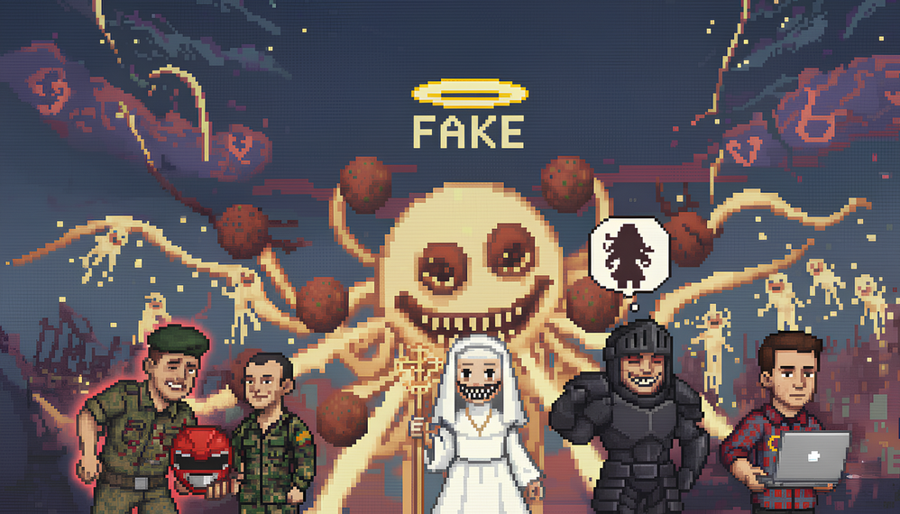

# Final Year Project | Glorious Deliverance Agency 1

[](https://opensource.org/licenses/MIT)
[](https://godotengine.org/)



This is my Final Year Project (FYP) exploring an **AI-Powered Dynamic Narrative System for RPGs**. The project investigates how Large Language Models (LLMs) can be effectively constrained to produce coherent, thematically consistent narratives in real-time gaming experiences.

**Department of Informatics, University of Sussex**

## The Game

An AI-native 2D RPG where you play a reluctant hero in a dysfunctional team whose attempts to save the world with "positive energy" only accelerate its destruction. The game implements a unique *Reality vs. Positive Energy" thematic framework as a dark satirical critique of toxic positivity and hustle culture.

Built with Godot 4.6.1 and typed GDScript, this repository contains the complete project including source code, Report and Video.

# Running the Project

1. Clone the repository:

    ```bash
    git clone https://github.com/dun4law/Individual-Project.git
    cd Individual-Project
    ```

2. **Option A - Using Godot Editor:**
   - Open the Godot Engine
   - Click "Import" and select the `project.godot` file from the root
   - Run the project from the editor

3. **Option B - Using Command Line:**

   ```bash
   # Launch the game
   godot4 --path .
   
   # Open in editor mode
   godot4 --path . --editor
   
   # Run all unit tests
   godot4 --headless --path . --run "res://1.Codebase/src/scenes/tests/all_tests_runner.tscn"
   ```

The main entry point is `1.Codebase/menu_main.tscn`.

# Project Structure

```
Individual-Project/
├── .github/                          # GitHub configuration and automation
│   ├── actions/                      # Custom GitHub Actions
│   │   └── setup-godot/              # Godot setup action
│   ├── scripts/                      # CI/CD utility scripts
│   │   └── font-tools/               # Font subsetting utilities
│   └── workflows/                    # CI/CD workflows
│       ├── build_game.yml            # Build and deploy workflow
│       ├── codeql.yml                # CodeQL security analysis
│       └── run-tests.yml             # Automated test runner
│
├── 1.Codebase/                       # Main game source code and assets
│   ├── src/                          # Source code and game assets
│   │   ├── scripts/                  # All GDScript code
│   │   │   ├── core/                 # Core autoload systems and managers (53 scripts)
│   │   │   │   ├── ai/               # AI system architecture
│   │   │   │   │   └── managers/     # AI managers (config, context, provider, request, usage stats, voice)
│   │   │   │   ├── agent/            # MCP agent server implementation
│   │   │   │   │   ├── agent_action_executor.gd  # Executes agent commands
│   │   │   │   │   ├── agent_protocol.gd         # Agent communication protocol
│   │   │   │   │   ├── game_agent_server.gd      # Main agent server
│   │   │   │   │   └── game_state_exporter.gd    # Exports game state for agents
│   │   │   │   ├── cli/              # In-game CLI/debug command system
│   │   │   │   │   ├── cli_ai_commands.gd        # AI-related CLI commands
│   │   │   │   │   ├── cli_command_parser.gd     # Command parsing logic
│   │   │   │   │   ├── cli_game_commands.gd      # Game state CLI commands
│   │   │   │   │   └── cli_save_commands.gd      # Save/load CLI commands
│   │   │   │   ├── game_state.gd                 # Central state management
│   │   │   │   ├── ai_manager.gd                 # AI narrative generation coordinator
│   │   │   │   ├── ai_memory_store.gd            # Persistent AI conversation memory
│   │   │   │   ├── ai_safety_filter.gd           # AI output safety and content filtering
│   │   │   │   ├── application_lifecycle_module.gd # App startup/shutdown lifecycle
│   │   │   │   ├── asset_database.gd             # Asset metadata database
│   │   │   │   ├── asset_interaction_system.gd   # Runtime asset interaction handling
│   │   │   │   ├── asset_registry.gd             # Asset cataloging and preloading
│   │   │   │   ├── audio_manager.gd              # Sound and music system
│   │   │   │   ├── background_loader.gd          # Async background image loading
│   │   │   │   ├── butterfly_effect_tracker.gd   # Choice consequence tracking
│   │   │   │   ├── character_expression_loader.gd # Character portrait expression loading
│   │   │   │   ├── cli_runner.gd                 # In-game CLI runner autoload
│   │   │   │   ├── credits_content.gd            # Credits screen data
│   │   │   │   ├── debuff_system.gd              # Player debuff management
│   │   │   │   ├── display_manager.gd            # Screen resolution and display settings
│   │   │   │   ├── error_codes.gd                # Centralised error code definitions
│   │   │   │   ├── error_reporter.gd             # Centralised error reporting
│   │   │   │   ├── error_reporter_bridge.gd      # Error reporter integration bridge
│   │   │   │   ├── event_bus.gd                  # Global event system
│   │   │   │   ├── event_log_system.gd           # Persistent in-game event log
│   │   │   │   ├── font_manager.gd               # Font loading (EN/ZH)
│   │   │   │   ├── fsm_challenge_module.gd       # FSM 30-day challenge logic and progress tracking
│   │   │   │   ├── fsm_daily_content_data.gd     # Daily content data for FSM challenge (themes, images)
│   │   │   │   ├── game_constants.gd             # Game-wide constants
│   │   │   │   ├── live_api_client.gd            # Live/streaming AI API client
│   │   │   │   ├── localization_manager.gd       # I18n translation system
│   │   │   │   ├── lru_cache.gd                  # Generic LRU cache utility
│   │   │   │   ├── metadata_store_module.gd      # Key-value metadata persistence
│   │   │   │   ├── mission_progress_module.gd    # Mission progress tracking
│   │   │   │   ├── mission_scenario_library.gd   # Mission scenario templates
│   │   │   │   ├── mock_ai_generator.gd          # Offline AI simulation mode
│   │   │   │   ├── npc_portrait_loader.gd        # NPC portrait asset loader
│   │   │   │   ├── ollama_client.gd              # Ollama local LLM client
│   │   │   │   ├── ollama_stream_request.gd      # Streaming Ollama request handler
│   │   │   │   ├── phase_manager_module.gd       # Game phase/act progression manager
│   │   │   │   ├── player_stats.gd              # Player statistics tracking
│   │   │   │   ├── save_load_system.gd           # Save/load functionality
│   │   │   │   ├── save_version_migrator.gd      # Save file version migration
│   │   │   │   ├── service_locator.gd            # Service registry pattern
│   │   │   │   ├── session_progress_tracker.gd   # Per-session progress tracking
│   │   │   │   ├── session_subsystem_registry.gd # Session subsystem registration
│   │   │   │   ├── skill_manager.gd              # MCP skill system integration
│   │   │   │   ├── story_exporter.gd             # Story export/serialization
│   │   │   │   ├── teammate_system.gd            # Teammate AI and behaviors
│   │   │   │   ├── translation_keys.gd           # Typed translation key constants
│   │   │   │   ├── trolley_problem_generator.gd  # Trolley problem dilemma generator
│   │   │   │   ├── tutorial_system.gd            # Tutorial and onboarding
│   │   │   │   ├── ui_debug_overlay.gd           # Developer debug overlay
│   │   │   │   └── voice_interaction_controller.gd # Voice synthesis controller
│   │   │   ├── ui/                   # UI controllers and components (86 scripts)
│   │   │   │   ├── fsm_challenge_overlay.gd      # FSM 30-day challenge overlay controller
│   │   │   │   ├── fsm_rebirth_explanation.gd    # FSM rebirth mechanic explanation UI controller
│   │   │   │   ├── story_scene.gd                # Main story scene controller
│   │   │   │   ├── story_*_controller.gd         # Story scene sub-controllers
│   │   │   │   ├── start_menu.gd                 # Main menu controller
│   │   │   │   ├── settings_menu.gd              # Settings screen
│   │   │   │   ├── pause_menu.gd                 # Pause overlay
│   │   │   │   ├── notification_system.gd        # In-game notifications
│   │   │   │   ├── achievement_viewer.gd         # Achievement display
│   │   │   │   ├── butterfly_effect_viewer.gd    # Butterfly effect visualization
│   │   │   │   └── ...                           # Other UI components
│   │   │   ├── game/                 # Game-specific logic scripts
│   │   │   │   └── ai_usage_example.gd           # Example AI integration script
│   │   │   └── tests/                # Test helper scripts
│   │   ├── scenes/                   # Godot scene files (.tscn)
│   │   │   ├── ui/                   # UI scene definitions
│   │   │   │   ├── fsm_challenge_overlay.tscn    # FSM 30-day challenge HUD overlay
│   │   │   │   └── fsm_rebirth_explanation.tscn  # FSM rebirth mechanic explanation screen
│   │   │   └── tests/                # Test runner scenes
│   │   ├── assets/                   # Game art and media files
│   │   │   ├── achievements/         # Achievement badge PNG icons
│   │   │   ├── backgrounds/          # Background images
│   │   │   ├── characters/           # Character portraits and expressions
│   │   │   ├── font/                 # Font files (EN, ZH-CN)
│   │   │   ├── icons/                # UI icons and symbols
│   │   │   ├── music/                # Background music tracks
│   │   │   ├── rebirth_challenge/    # FSM 30-day challenge daily images
│   │   │   ├── sound/                # Sound effects
│   │   │   │   └── gloria/           # Gloria voice lines (en/, zh/)
│   │   │   └── ui/                   # UI textures and graphics
│   │   │       └── intro/            # Intro story page images
│   │   ├── data/                     # Game data files
│   │   │   ├── teammates.json        # Teammate definitions
│   │   │   ├── teammate_behaviors.json # Teammate AI behaviors
│   │   │   ├── team_relationships.json # Relationship graph data
│   │   │   └── gloria_voice_script.txt # Gloria voice script
│   │   └── skills/                   # MCP skills for AI agents
│   │       ├── character-profiles/   # Character background skills
│   │       ├── consequence-generation/ # Choice consequence skills
│   │       ├── entropy-effects/      # Entropy system skills
│   │       ├── game-recap/           # End-of-session game recap skills
│   │       ├── gloria-intervention/  # Gloria intervention skills
│   │       ├── honeymoon-phase/      # Early game phase skills
│   │       ├── intro-story/          # Intro narrative skills
│   │       ├── mission-generation/   # Mission creation skills
│   │       ├── night-cycle/          # Night cycle event skills
│   │       ├── prayer-system/        # Prayer mechanic skills
│   │       ├── scene-directives/     # Scene direction skills
│   │       └── teammate-interference/ # Teammate interaction skills
│   ├── Unit Test/                    # Comprehensive unit test suite
│   │   ├── test_*.gd                 # Unit test files (game_state, audio, AI, etc.)
│   │   └── README.md                 # Test documentation
│   ├── localization/                 # Internationalization files
│   │   ├── gda1_translations*.csv    # Main translation tables
│   │   ├── intro_story_pages.csv     # Intro story translations
│   │   └── *.translation             # Compiled Godot translation files
│   ├── mcp/                          # MCP server for external agent interaction
│   │   ├── connection.py             # Python MCP server implementation
│   │   ├── pyproject.toml            # Python package configuration
│   │   └── README.md                 # MCP setup and usage documentation
│   ├── tools/                        # Development utilities
│   │   └── test_agent_client.py      # Agent client test script
│   ├── menu_main.tscn                # Main menu entry point (configured in project.godot)
│   └── main.tscn                     # Bootstrap scene
│
├── 2.Report/                         # Academic project reports and documentation
│   ├── Final report Example/         # Example FYP reports from previous years
│   ├── Final report Guidance/        # FYP guidance documents
│   ├── Final_Report.md               # Final report (Markdown source)
│   ├── Final_Report.pdf              # Final report (PDF)
│   ├── Final_Report.tex              # Final report (LaTeX source)
│   ├── Interim Report_281967.pdf     # Interim project report
│   ├── Duncan Law Poster.pdf         # Project poster
│   └── gdd game design doc.txt       # Game design document
│
├── 3.Video/                          # Demo videos and recordings
│
├── 4.Pre-Built V1.0/                 # Pre-compiled game binaries (V1.0)
│   └── README.md                     # Build notes and usage instructions
│
├── cloudflare-worker/                # Cloudflare Worker AI proxy
│   ├── gemini-proxy.js               # Gemini API reverse proxy worker
│   └── wrangler.toml                 # Cloudflare Wrangler configuration
│
├── AGENTS.md                         # AI agent instructions and conventions
├── LICENSE.md                        # MIT License
├── readme.md                         # This file - project overview
├── project.godot                     # Godot project configuration (autoloads, settings)
├── export_presets.cfg                # Export settings for Web, Windows, Linux
├── clean_audio_metadata.py           # Utility to strip audio file metadata
├── regenerate_backgrounds.py         # Utility to regenerate background assets
└── remove_comments.py                # Utility to strip comments from GDScript files
```

## Key Directories Explained

### Core Systems (`1.Codebase/src/scripts/core/`)
Contains 53 root-level autoload scripts plus subdirectories (`ai/`, `agent/`, `cli/`) that form the game's backbone:
- **AI System**: Multi-provider AI integration (OpenAI, Anthropic, Ollama, live streaming) with request management, context building, safety filtering, memory store, and voice synthesis
- **Agent System**: MCP (Model Context Protocol) server for external AI agent interaction
- **CLI System**: In-game developer command-line interface for debug, AI, save, and game state commands
- **State Management**: Game state, player stats, mission progress, phase management, session tracking
- **Asset Management**: Asset registry, background loader, character expression loader, NPC portrait loader, font manager
- **Event Systems**: EventBus for cross-module communication, butterfly effect tracking, event log
- **Save/Load**: Comprehensive save system with JSON serialization and version migration
- **UI Systems**: Notification system, tutorial system, UI debug overlay, display manager
- **Audio**: Music and sound effect management with pooling

### UI Controllers (`1.Codebase/src/scripts/ui/`)
86 UI controller scripts following the controller pattern:
- **Story Scene**: Main story scene with 8 sub-controllers (narrative, choice, flow, state, overlay, assets, UI, coordinator)
- **Menu Systems**: Start menu, pause menu, settings menu, save/load menu
- **Overlays**: Choice selection, Gloria intervention, night cycle, trolley problem
- **Viewers**: Achievement viewer, butterfly effect viewer, gameplay stats, relationship graph
- **Popups**: Notification popup, tutorial popup, prayer notice

### Skills (`1.Codebase/src/skills/`)
Structured prompts and instructions for AI agents to generate context-aware game content. 12 skill folders cover all major game mechanics — including the new `game-recap` skill for end-of-session summaries. Each folder contains markdown files that guide the AI in creating narratives, consequences, and game mechanics that align with the game's thematic framework.

### Cloudflare Worker (`cloudflare-worker/`)
A lightweight Cloudflare Worker acting as a reverse proxy for the Gemini API, enabling API key protection and CORS handling for web builds.

### Localization (`1.Codebase/localization/`)
Full bilingual support (English/Chinese) with CSV translation tables and compiled Godot translation resources. Includes comprehensive UI translations and intro story localization.

# Testing

Run the comprehensive test suite locally:

```bash
godot4 --headless --path . --run "res://1.Codebase/src/scenes/tests/all_tests_runner.tscn"
```

# Build & Deployment

The project uses GitHub Actions for automated building and deployment.

- **Manual Trigger**: The `Build and Deploy Game` workflow is triggered manually via the `workflow_dispatch` event in the Actions tab.
- **Platforms**: Builds are generated for:
  - Web (HTML5)
  - Windows Desktop
  - Linux (x86_64)
  - Linux ARM64
- **Releases**: A GitHub Release is automatically created with zipped artifacts for each platform.
- **Web Deployment**: The Web build is automatically deployed to the `gh-pages` branch.

# License

This project is licensed under the MIT License - see the [LICENSE.md](LICENSE.md) file for details.
